# Getting started with FESDIA for steady and dynamic simulation

## FESDIA

``` r
require(FESDIA)
#> Warning: no DISPLAY variable so Tk is not available
```

Tne FESDIA package contains functions to generate diagenetic profiles,
describing the cycles of C, N, O2, Fe, S and P. It is based on the
OMEXDIA model (Soetaert et al., 1996a, b), extended with P, S, Fe
dynamics.

The model describes seventeen state variables, in 100 layers:

- 2 fractions of organic carbon (FDET,SDET): fast and slow decaying,
  solid substance.
- Oxygen (O2), dissolved substance.
- Nitrate (NO3), dissolved substance.
- Nitrite (NO2), dissolved substance.
- Ammonia (NH3), dissolved substance.
- Dissolved inorganic carbon (DIC), dissolved substance
- Iron 2+ (Fe), dissolved substance
- Sulphide (H2S), dissolved substance
- Methane (CH4), dissolved substance
- Phosphate (PO4), dissolved substance
- Alkalinity (ALK), dissolved substance
- Iron hydroxides (FeOH3), solid substance
- Iron-bound P (FeP), P bound to iron oxides, solid substance
- Ca-bound P (CaP), apatite, solid substance
- Adsorbed P (Pads), solid substance

Time is expressed in days, and space is expressed in centimeters.

Concentrations of liquids and solids are expressed in \[nmol/cm3
liquid\] and \[nmol/cm3 solid\] respectively (Note: this is the same as
\[mmol/m3 liquid\] and \[mmol/m3 solid\]).

Compared to the OMEXDIA model, FESDIA includes the following additions:

- simple phosphorus, iron and sulphur dynamics
- long-distance H2S and CH4 oxidation, e.g. by cable bacteria or worms
  associated with chemosynthetic bacteria
- allowing boundary conditions with water overlying sediment or exposure
  to the air.
- external conditions set either with time-variable forcings or as
  constant parameters
- bottom water conditions either imposed or dynamically modeled
- possibility to include sediment perturbation events
- vertical profiles of porosity, irrigation, bioturbation either set
  with parameters or inputted as data.

The model is implemented in fortran (for speed) and linked to R (for
flexibility).

## The package

The FESDIA package contains functions to generate (a time series of) 1-D
diagenetic profiles. It can either be run in dynamic mode, or the
steady-state solution can be estimated. It contains several utility
functions, e.g. to help in extracting information on the model output,
or to estimate mass budgets. It contains functions to perturb sediment
properties, e.g. mimicking resuspension or deposition events.

The main functions allow to solve the model to steady state
(*FESDIAsolve*), to run it dynamically (*FESDIAdyna*), or to add
perturbations (*FESDIAperturb*) to dynamic simulations (this is
discussed in another vignette)..

### Steady-state solution, function FESDIAsolve

Function *FESDIAsolve* finds the steady-state solution of the FESDIA
model. Its arguments are:

``` r
args(FESDIAsolve)
function (parms = list(), yini = NULL, gridtype = 1, Grid = NULL, 
    porosity = NULL, bioturbation = NULL, irrigation = NULL, 
    surface = NULL, diffusionfactor = NULL, dynamicbottomwater = FALSE, 
    ratefactor = NULL, calcpH = FALSE, verbose = FALSE, method = NULL, 
    times = c(0, 1e+06), ...) 
NULL
```

here *parms* is a list with a subset of the FESDIA parameters (see
appendix for what they mean and their default values). If unspecified,
then the default parameters are used.

The *gridtype* by default assumes a cartesian grid (*gridtype = 1*), but
can be 1D cylindrical (*gridtype = 2*) or spherical (*gridtype = 3*). An
irregular grid can be seleceted by specifying the surface areas at the
interface through argument *surface*. In a cartesian grid the surface
area remains constant.

The vertical profiles that can be imposed as a vector are: *porosity*,
*bioturbation* *irrigation*, *surface* (surface areas of box interfaces)
and *diffusionfactor* (multiplication factor to estimate effective
sediment diffusion based on molecular diffusion).

*dynamicbottomwater*, when set to TRUE will also explicitly model the
bottom water concentrations.

*ratefac* is a multiplication factor, that is multiplied with all
biogeochemical rates. It is included here for consistency with
*FESDIAdyna*.

### Dynamic run, function FESDIAdyna

Function *FESDIAdyna* runs the FESDIA model for a specific time interval
and produces output at requested times. Its arguments are:

``` r
args(FESDIAdyna)
function (parms = list(), times = 0:365, spinup = NULL, yini = NULL, 
    gridtype = 1, Grid = NULL, porosity = NULL, bioturbation = NULL, 
    irrigation = NULL, surface = NULL, diffusionfactor = NULL, 
    dynamicbottomwater = FALSE, CfluxForc = NULL, FeOH3fluxForc = NULL, 
    CaPfluxForc = NULL, O2bwForc = NULL, NO3bwForc = NULL, NO2bwForc = NULL, 
    NH3bwForc = NULL, FebwForc = NULL, H2SbwForc = NULL, SO4bwForc = NULL, 
    CH4bwForc = NULL, PO4bwForc = NULL, DICbwForc = NULL, ALKbwForc = NULL, 
    wForc = NULL, biotForc = NULL, irrForc = NULL, rFastForc = NULL, 
    rSlowForc = NULL, pFastForc = NULL, MPBprodForc = NULL, gasfluxForc = NULL, 
    MnbwForc = NULL, MnO2fluxForc = NULL, HwaterForc = NULL, 
    ratefactor = NULL, calcpH = FALSE, verbose = FALSE, ...) 
NULL
```

The functions to run the model dynamically also allow for several
external conditions to be either constants or to vary in time. Thus,
they can be set by a parameter or as a forcing function.

These conditions are:

- the flux of carbon, CaP and FeP (*Cflux, CaPflux, FeOH3flux*),
  forcings *CfluxForc, CaPfluxForc, FeOH3fluxForc*),  
- the bottom water concentrations (*O2bw, NO2bw, NO3bw, NH3bw, H2Sbw,
  PO4bw, DICbw, ALKbw*), forcings *O2bwForc, NO3bwForc, NO2bwForc,
  NH3bwForc, ODUbwForc, PO4bwForc, DICbwForc, ALKbwForc*)
- the sedimentation, bioturbation and bio-irrigation rates (*w, biot,
  irr*), (*wForc, biotForc, irrForc*)
- the decay rates of organic matter (*rFast, rSlow*) and the fraction
  fast organic matter present in the flux (*pFast*), forcings
  (*rFastForc, rSlowForc, pFastForc*)
- the microphytobenthos production rate (*MPBprod*), (*MPBprodForc*)
- the air-sea exchange rate when exposed to the air (*gasflux*),
  (*gasfluxForc*)
- the height of the overlying water (*Hwater*), (*HwaterForc*), used
  only if *dynamicbottomwater* is *TRUE*.
- *ratefac* is a (time series or a constant) multiplication factor, that
  is multiplied with all biogeochemical rates. It can be used to impose
  temperature dependency.

These forcing functions are either prescribed as a list that either
contains a data series (*list (data = …)*) or as a list that specifies a
periodic signal, defined by the amplitude (*amp*), *period*, *phase*, a
coefficient that defines the strength of the periodic signal (*power*)
and the minimum value (*min*) : the default settings are: *list(amp = 0,
period = 365, phase = 0, pow = 1, min = 0)*. The mean value in the sine
function is given by the corresponding parameter.

For instance, for the C flux, the seasonal signal would be defined as:
$max(min,Cflux*\left( 1 + \left( amp*sin\left( (times - phase)/period*2*pi \right) \right)^{p}ow \right)$.

### Perturbation run, function FESDIAperturb

``` r
args(FESDIAperturb)
function (parms = list(), times = 0:365, spinup = NULL, yini = NULL, 
    gridtype = 1, Grid = NULL, porosity = NULL, bioturbation = NULL, 
    irrigation = NULL, surface = NULL, diffusionfactor = NULL, 
    dynamicbottomwater = FALSE, perturbType = "deposit", perturbTimes = NULL, 
    perttype_mat = NULL, perturbDepth = 5, concfac = NULL, CfluxForc = NULL, 
    FeOH3fluxForc = NULL, CaPfluxForc = NULL, O2bwForc = NULL, 
    NO3bwForc = NULL, NO2bwForc = NULL, NH3bwForc = NULL, FebwForc = NULL, 
    H2SbwForc = NULL, SO4bwForc = NULL, CH4bwForc = NULL, PO4bwForc = NULL, 
    DICbwForc = NULL, ALKbwForc = NULL, wForc = NULL, biotForc = NULL, 
    irrForc = NULL, rFastForc = NULL, rSlowForc = NULL, pFastForc = NULL, 
    MPBprodForc = NULL, gasfluxForc = NULL, HwaterForc = NULL, 
    ratefactor = NULL, MnbwForc = NULL, MnO2fluxForc = NULL, 
    verbose = FALSE, extmix = FALSE, ...) 
NULL
```

Three types of perturbations are possible (argument *perturb*):

- *mixing* straightens the profiles over a certain depth
- *erosion* removes part of the surficial sediment
- *deposition* adds sediment on top.

These perturbations are implemented as events, and need input of the
perturbation times (*perturbTimes*), and the depth (*perturbDepth*). For
deposition events, the factor of increase/decrease of the solid fraction
concentrtion can also be inputted (*concfac*).

### Accessory functions

The default values of the parameters, and their units can be
interrogated:

``` r
P  <- FESDIAparms()
head(P)
#>                  parms       units                description
#> Cflux     4.566210e+02 nmolC/cm2/d total organic C deposition
#> pFast     9.000000e-01           -   part FDET in carbon flux
#> FeOH3flux 1.000000e+00  nmol/cm2/d   deposition rate of FeOH3
#> CaPflux   0.000000e+00  nmol/cm2/d     deposition rate of CaP
#> rFast     6.849315e-02          /d            decay rate FDET
#> rSlow     1.369863e-04          /d            decay rate SDET
```

Note: some parameters only apply if the bottom water concentration is
modeled dynamically; they comprise the *dilution* of the bottom water
(nudging to bottom water concentration), the height of the bottom water
(*Hwater*), and the sinking rate of the solid constituents (C, FeP,
FeOH3) (parameters *Cfall*, *FePfall* and *FeOH3fall*).

### Budgets

Once the model is solved, it is possible to calculate budgets of the C,
N, P, S, Fe and O2 cycle (*FESDIAbudgetC*, *FESDIAbudgetN*,
*FESDIAbudgetP*, *FESDIAbudgetS*, *FESDIAbudgetFe*, *FESDIAbudgetO2*).

``` r
std <- FESDIAsolve()
print(FESDIAbudgetC(std))
#> Warning in rbind(deparse.level, ...): number of columns of result, 7, is not a
#> multiple of vector length 4 of arg 2
#> $Fluxes
#>                  FDET         SDET           DIC           CH4 CinCaP CaCO3
#> surface  4.109589e+02 4.566210e+01 -4.550175e+02 -4.391394e-08      0     0
#> bottom  1.001633e-191 1.168446e-71  4.502289e-03  1.702274e-44      0     0
#> perturb  0.000000e+00 0.000000e+00  0.000000e+00  0.000000e+00      0     0
#> netin    4.109589e+02 4.566210e+01 -4.550220e+02 -4.391394e-08      0     0
#>         ARAG       Total
#> surface    0 1.603499474
#> bottom     0 0.004502289
#> perturb    0 0.000000000
#> netin      0 1.598997186
#> 
#> $Rates
#>             OxicMineralisation Denitrification ManganeseReduction IronReduction
#> nmolC/cm2/d           427.0496         9.43749         0.09673114     0.1253984
#>             SulphateReduction Methanogenesis TotalMineralisation CH4oxidation
#> nmolC/cm2/d          19.27247      0.6393563             456.621   0.01795032
#>             MnCO3precitation CH4oxid.dist CH4oxidAOM MPBDICuptake
#> nmolC/cm2/d        0.7167273            0  0.3017278            0
#>             MPBFDETproduction MPBResp CaPprecipitation CaPdissolution
#> nmolC/cm2/d                 0       0                0              0
#>             CaCO3dissolution ARAGdissolution CaCO3production
#> nmolC/cm2/d                0               0               0
#> 
#> $Losses
#> [1] 0.004502289
#> 
#> $dC
#>           Ext           DET           DIC           CaP           CH4 
#>  1.603500e+00 -5.684342e-14 -8.822699e-01  0.000000e+00 -4.392358e-08 
#>           MPB         MnCO3         CaCO3          ARAG        Burial 
#>  0.000000e+00 -7.167273e-01  0.000000e+00  0.000000e+00 -4.502289e-03 
#>           sum 
#> -1.012818e-14 
#> 
#> $Delta
#> [1] 1.598997
#> 
#> $Fluxmat
#>             Ext     DET         DIC CaP       CH4 MPB     MnCO3 CaCO3 ARAG
#> Ext      0.0000 456.621   0.0000000   0 0.0000000   0 0.0000000     0    0
#> DET      0.0000   0.000 456.3013264   0 0.3196781   0 0.0000000     0    0
#> DIC    455.0175   0.000   0.0000000   0 0.0000000   0 0.7167273     0    0
#> CaP      0.0000   0.000   0.0000000   0 0.0000000   0 0.0000000     0    0
#> CH4      0.0000   0.000   0.3196781   0 0.0000000   0 0.0000000     0    0
#> MPB      0.0000   0.000   0.0000000   0 0.0000000   0 0.0000000     0    0
#> MnCO3    0.0000   0.000   0.0000000   0 0.0000000   0 0.0000000     0    0
#> CaCO3    0.0000   0.000   0.0000000   0 0.0000000   0 0.0000000     0    0
#> ARAG     0.0000   0.000   0.0000000   0 0.0000000   0 0.0000000     0    0
#> Burial   0.0000   0.000   0.0000000   0 0.0000000   0 0.0000000     0    0
#>              Burial
#> Ext    0.000000e+00
#> DET    1.168446e-71
#> DIC    4.502289e-03
#> CaP    0.000000e+00
#> CH4    0.000000e+00
#> MPB    0.000000e+00
#> MnCO3  0.000000e+00
#> CaCO3  0.000000e+00
#> ARAG   0.000000e+00
#> Burial 0.000000e+00
```

### pH calculation

pH can be calculated after the solution has been found, both for
steady-state and dynamic runs. Plotting of these pH profiles has to be
done with the default plotting functions.

#### Steady-state pH profile

``` r
  std  <- FESDIAsolve(parms = list(Cflux = 2*1e5/12/365))
  std2 <- FESDIAsolve(parms = list(Cflux = 20*1e5/12/365))
  std3 <- FESDIAsolve(parms = list(Cflux = 200*1e5/12/365))
  pH  <- FESDIApH(std)
  pH2 <- FESDIApH(std2)
  pH3 <- FESDIApH(std3)
  matplot(x = cbind(pH, pH2, pH3), y = FESDIAdepth(std), ylim = c(10,0), 
    main = "pH", ylab= "cm", type = "l", xlab = "-", lwd = 2, lty = 1)
  legend("bottomright", legend = c(2,20,200), title = "gC/m2/yr", 
    lty=1, col = 1:3, lwd = 2)
```

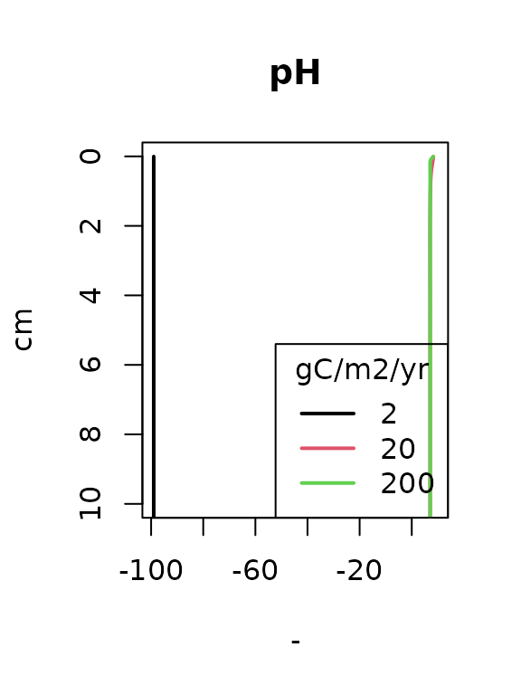

#### Dynamic pH solutions

``` r
  Cflux2 <- cbind (time = c(0, 100,  150,  175, 200, 250, 365),
                  flux = c(1, 1,    1000, 800, 1200, 10, 1)) 
  Cflux1 <- Cflux3 <- Cflux2
  Cflux1[,2] <- Cflux1[,2]/10
  Cflux3[,2] <- Cflux3[,2]*10
  
  out1 <- FESDIAdyna(parms = list(pFast = 0.9), CfluxForc = list(data = Cflux1), 
                     spinup = 0:365, times = 0:365)
  out2 <- FESDIAdyna(parms = list(pFast = 0.9), CfluxForc = list(data = Cflux2), 
                     spinup = 0:365,  times = 0:365)
  out3 <- FESDIAdyna(parms = list(pFast = 0.9), CfluxForc = list(data = Cflux3),  
                     spinup = 0:365, times = 0:365)
  pH1 <- FESDIApH(out1)
  pH2 <- FESDIApH(out2)
  pH3 <- FESDIApH(out3)
```

``` r
  par(oma = c(0,0,2,0))
  image2D(out1, ylim = c(10, 0), mfrow = c(3, 3), 
      which = c("NH3", "O2", "NO3", "PO4", "H2S", "Fe", "SO4", "ALK"))
  image2D(pH1, ylim = c(10,0), y = FESDIAdepth(out1), x = out1[,1], 
         clab = "", xlab = "day", ylab = "cm", main = "pH")
  title(main = "Low flux", outer = TRUE)
```

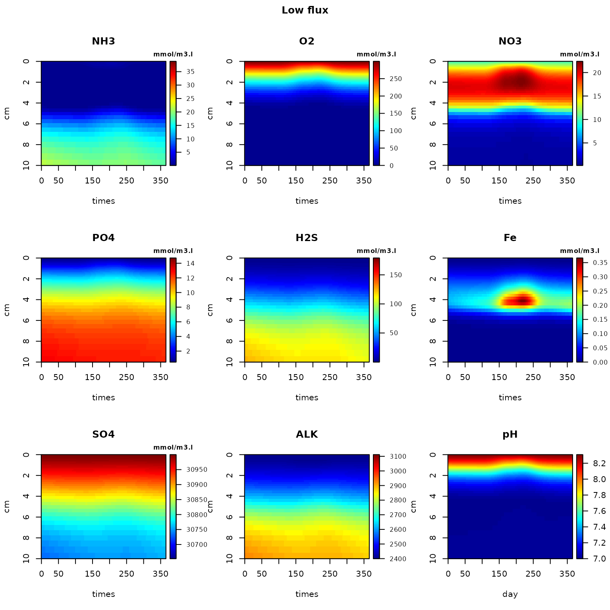

``` r

  image2D(out3, ylim = c(10, 0), 
    mfrow = c(3, 3), which = c("NH3", "O2", "NO3", "PO4", "H2S", "Fe", "SO4", "ALK"))
  plot3D::image2D(pH3, ylim = c(10,0), y = FESDIAdepth(out3), x = out3[,1], 
         clab = "", xlab = "day", ylab = "cm", main = "pH")
  title(main = "High flux", outer = TRUE)
```

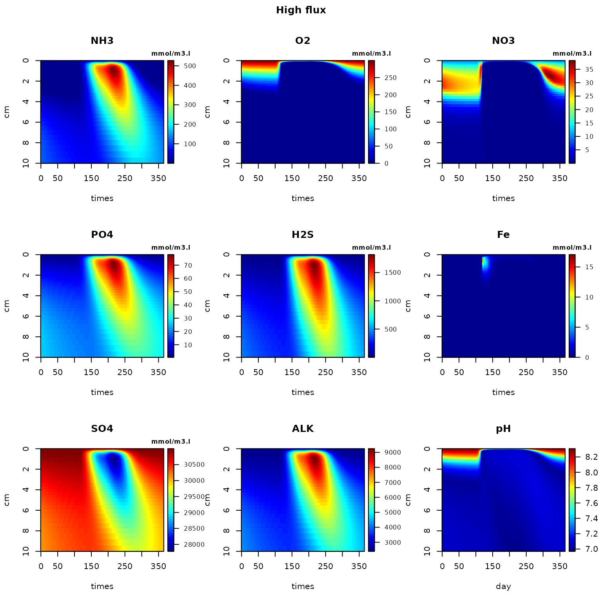

### Properties of solutions

There are functions to retrieve several properties of the solution:

- *FESDIAdepth*, *FESDIAdx*, *FESDIAgrid* retrieve the sediment depths,
  layer thicknesses and grid of *FESDIA* model solutions.
- *FESDIAbiot*, *FESDIApor*, *FESDIAirr* retrieve the bioturbation,
  porosity, and irrigation profiles of *FESDIA* model solutions.
- *FESDIA0D* and *FESDIA1D* return the output variables of the solution
  as a vector or data.frame. For dynamic runs, the output is averaged
  over the mean of the run. *FESDIA1D* always returns the sediment depth
  and the porosity as the first two columns.

``` r
head(FESDIAdepth(std))
#> [1] 0.00498923 0.01530360 0.02631242 0.03806243 0.05060354 0.06398901
head(FESDIA1D(std), n = 3)
#>            x       por     FDET     SDET       O2      NO3        NO2       NH3
#> 1 0.00498923 0.8934027 15551.22 18170.33 298.6889 10.24457 0.01558353 0.9979307
#> 2 0.01530360 0.8801069 14220.97 18018.59 295.9077 10.76518 0.04667736 0.9935963
#> 3 0.02631242 0.8664113 12992.01 17874.02 292.8532 11.33804 0.07857833 0.9887928
#>        DIC Fe    FeOH3 H2S      SO4        CH4 PO4 FeP          CaP Pads
#> 1 2094.087  0 164253.4   0 30985.74 0.0000e+00   0   0 9.275413e-29    0
#> 2 2081.474  0 261444.1   0 30955.39 0.0000e+00   0   0 9.275490e-29    0
#> 3 2067.565  0      0.0   0 30921.98 5.1651e-10   0   0 9.275548e-29    0
#>            ALK FeOH3B         Mn     MnO2    MnO2B       TOC DICprodMin
#> 1 2.809786e+29      0 0.01110377 270.3265 292.2790 0.5161863   127.3867
#> 2 8.791168e+29      0 0.03473124 253.7424 275.5894 0.5154750   133.0253
#> 3 1.537406e+30      0 0.06074174 237.9841 259.6211 0.5148157   137.5823
#>   DINprodMin DIPprodMin O2prod  Oxicmin Denitrific  Feredmin       BSRmin
#> 1   19.22818   1.201761      0 126.9792  0.1089403 0.2685374 2.326098e-06
#> 2   20.07929   1.254956      0 132.5880  0.1191230 0.2886496 1.520719e-06
#> 3   20.76714   1.297946      0 137.4239  0.1295825 0.0000000 3.346915e-05
#>        Methmin   nitri1    nitri2     Anammox Feoxid H2Soxid      CH4oxid
#> 1 7.647814e-08 19.89202 0.3106307 0.001555129      0       0 0.000000e+00
#> 2 5.004854e-08 19.80500 0.9304030 0.004637845      0       0 0.000000e+00
#> 3 1.102718e-06 19.70856 1.5662185 0.007769769      0       0 4.084063e-06
#>            AOM FeSprod FePadsorp FePdesorp CaPprod CaPdiss Padsorb H2Soxsurf
#> 1 0.000000e+00       0         0         0       0       0       0         0
#> 2 0.000000e+00       0         0         0       0       0       0         0
#> 3 4.791454e-10       0         0         0       0       0       0         0
#>   CH4oxsurf O2distConsump   ALKprod    DICprodCH4 MPBCprod MPBuptakeNO3
#> 1         0             0 -19.54184 -3.823907e-08        0            0
#> 2         0             0 -18.44229 -2.502427e-08        0            0
#> 3         0             0 -19.95032  3.533183e-06        0            0
#>   MPBuptakeNH3 MPBuptakePO4 MPBuptakeDIC   MnredMin  sumMnO2 sumFeOH3
#> 1            0            0            0 0.03004508 562.6054 164253.4
#> 2            0            0            0 0.02951712 529.3319 261444.1
#> 3            0            0            0 0.02875197 497.6052      0.0
#>   FeOxidMnASC H2SOxidFeOH3ASC H2SoxidMnO2ASC MnSprod      MnOxid  AgeFeOx
#> 1           0               0              0       0 0.002865519 255.4468
#> 2           0               0              0       0 0.008879535 406.5978
#> 3           0               0              0       0 0.015369187   0.0000
#>    AgeMnOx   MnCO3prec
#> 1 1.261235 0.006975676
#> 2 1.183861 0.021687655
#> 3 1.110339 0.037676245
```

``` r
FESDIAparms(std, which = "Cflux")
#>         parms       units                description
#> Cflux 45.6621 nmolC/cm2/d total organic C deposition
```

## Steady-state applications

The function *FESDIAsolve* solves for a steady-state condition.

### Simple applications

In the frst example, we run the model for different carbon deposition
rates (expressed in *nmolC/cm2/d*) and plot the results using
*rootSolve*’s *plot* function.

``` r
convert <- 1e5/12/365
STD1 <- FESDIAsolve ()
STD2 <- FESDIAsolve (parms = list(Cflux = 100*convert))
STD3 <- FESDIAsolve (parms = list(Cflux = 2*convert))
plot(STD1, STD2, STD3, lwd = 2, which = 2:10)
legend("bottom", legend = c(20, 100, 2), lty = 1, col = 1:3, title = "gC/m2/yr")
```

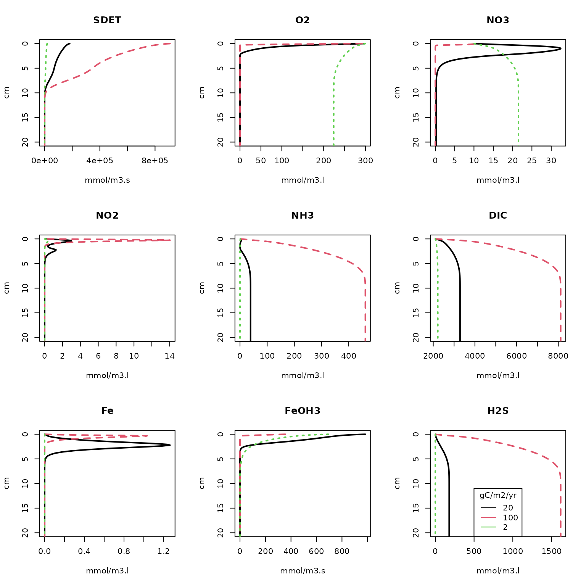

### User-inputted profiles

By default porosity, bioturbation, and bio-irrigation profiles are
generated based on parameter settings. However, it is possible to
directly impose profiles for these quantities.

In the following example, an irrigation profile is generated where there
is substantial irrigation only in a certain section of the sediment
(\[2-3 cm\]).

``` r
Grid <- FESDIAgrid()
Irr <- rep(0, Grid$N)
Irr[Grid$x.mid > 2 &  Grid$x.mid < 3] <- 1   
out <- FESDIAsolve()
irrout <- FESDIAsolve(irrigation = Irr)
plot(out, irrout, 
     ylim = c(10, 0), lty = 1, lwd = 2, which = c(3:9))
plot(out, irrout, 
     ylim = c(10, 0), lty = 1, lwd = 2, which = c("TOC"), mfrow = NULL)
matplot(x=cbind(FESDIAirr(out), FESDIAirr(irrout)), y = FESDIAdepth(out), 
     ylim = c(10, 0), type = "l", lty = 1:2, lwd = 2, main = "irrigation")
```

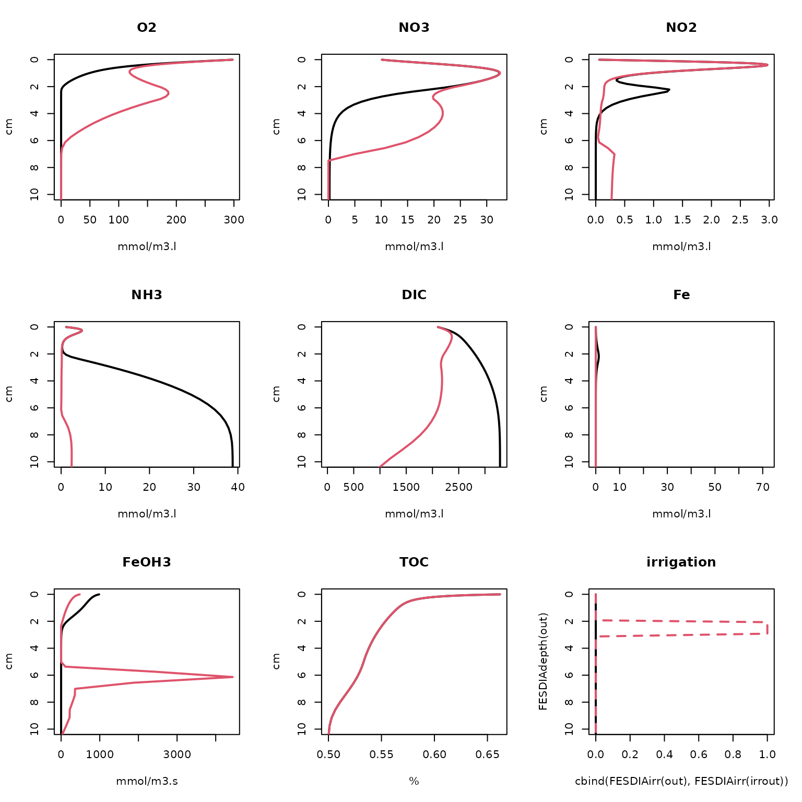

``` r
pH <- cbind(FESDIApH(out), FESDIApH(irrout))
matplot(x = pH, y = FESDIAdepth(out), ylim = c(20,0), 
        type = "l", main = "pH", lty = 1, ylab = "depth")
```

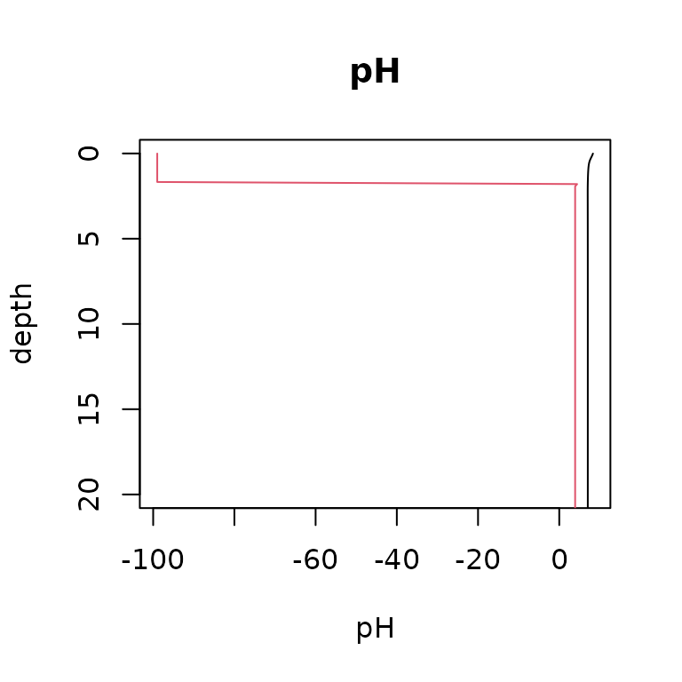

### Microphytobenthos production

MPB is modeled in a straightforward way, by imposing the maximal
(unlimited) oxygen production rate (parameter *MPBprod*), an exponential
decay parameter (*kMPB*), describing light penetration, and nutrient and
DIC limitation, modeled by a Monod equations, with parameters *kNH3upt*,
*kPO4upt* and *kDICupt* respectively.

The larger the MPB production rate, the more difficult it becomes to
find a solution. Difficult cases can be solved by ramping up the
solution, using previous solutions as initial guesses for the next
solution.

``` r

out1 <- FESDIAsolve(parms = c(por0 = 0.5, MPBprod = 0))
out2 <- FESDIAsolve(parms = c(por0 = 0.5, MPBprod = 1e2), yini = out1$y)
out2b <- FESDIAsolve(parms = c(por0 = 0.5, MPBprod = 1e3), yini = out2$y)
out2c <- FESDIAsolve(parms = c(por0 = 0.5, MPBprod = 5e3), yini = out2b$y, method = "mixed")
out2d <- FESDIAsolve(parms = c(por0 = 0.5, MPBprod = 8e3), yini = out2c$y, method = "mixed")
out3 <- FESDIAsolve(parms = c(por0 = 0.5, MPBprod = 1e4), yini = out2d$y, method = "mixed")
out4 <- FESDIAsolve(parms = c(por0 = 0.5, MPBprod = 5e4), yini = out3$y, method = "mixed")
out5 <- FESDIAsolve(parms = c(por0 = 0.5, MPBprod = 1e5), yini = out4$y, method = "mixed")
PH1 <- FESDIApH(out1)
PH2 <- FESDIApH(out2)
PH3 <- FESDIApH(out3)
PH4 <- FESDIApH(out4)
PH5 <- FESDIApH(out5)
```

``` r
plot(out1, out2, out3, out4, out5,  ylim = c(10, 0), 
    lty = 1, lwd = 2, which = c(4,5:7), mfrow = c(2, 3))
legend("center", col = 1:5, title = "prod, mmol/m3/d", legend = c(0, 1e2, 1e4,  5e4, 1e5), lty = 1) 
plot(out1, out2, out3, out4, out5, ylim = c(3, 0), 
  lty = 1, lwd = 2, which = 3, mfrow = NULL)
matplot(x = cbind(PH1, PH2, PH3, PH4, PH5), y = FESDIAdepth(out1), type = "l",
     ylim = c(3, 0), lty = 1, lwd = 2, main = "pH", ylab = "", xlab = "")
```

``` r
pH <- cbind(FESDIApH(out1),FESDIApH(out2),FESDIApH(out3),FESDIApH(out4))
par(mfrow = c(1,2))
matplot(x = pH, y = FESDIAdepth(out1), ylim = c(2,0), 
        type = "l", main = "pH", lty = 1, lwd = 2, ylab = "depth")
matplot(x = pH, y = FESDIAdepth(out1), ylim = c(10,0), 
        type = "l", main = "pH", lty = 1, lwd = 2, ylab = "depth")
```

``` r
FESDIAbudgetO2(out1, out2, out3, out4)
FESDIAbudgetC (out1, out2, out3, out4, which = "Rates")
```

### Dry flats (but moist sediment)

When flats are dry, the exchange is governed by a piston velocity. The
exchange of substances at the upper interface can take on two modes:
exchange with water overlying the sediment or exchange with the
atmosphere.

When the parameter *gasflux*, or forcing function *gasfluxForc* is 0,
this means that the sediment is submersed. When they have a positive
value, equal to the piston velocity, (units \[cm/d\]), this means that
the sediment is exposed to the air. In that case, only oxygen and DIC
are exchanged with the air at the upper interface, while there is no
exchange for NH3, NO3, NO2, PO4, … Deposition of the two carbon
fractions and of FeOH3, CaP continues.

``` r
out    <- FESDIAsolve()
outdry <- FESDIAsolve(parms = list(gasflux = 1e2), yini = out$y)

plot(out1, outdry, ylim = c(10, 0), lty = 1, lwd = 2, 
     which = c("O2","NO3","NH3","PO4","FeP","TOC"))
legend("center", col = 1:2, title = "exchange", legend = c("water","dry"), lty = 1) 

print(FESDIAbudgetO2(outdry))
print(FESDIAbudgetN(outdry))
```

### Long distance oxidation

Parameters *rSurfH2Sox*, *rSurfCH4ox*,*ODUoxdepth* and *ODUoxatt* define
the deep H2S or CH4 oxidation rate consuming oxygen from the surface
layer.

The larger the oxidation rate, the more difficult it becomes to find a
solution, so difficult cases can be solved by ramping up the solution,
using previous solutions as initial guesses for the next solution.

It also helps to run the model dynamically to steady-state.

This will only be effective if sufficient H2S is formed, so the Carbon
flux is sufficiently high.

Three parameters determine the long distance oxidation:

``` r
FESDIAparms(which = c("rSurfH2Sox", "rSurfCH4ox","ODUoxdepth", "ODUoxatt"))
#>            parms units                            description
#> rSurfH2Sox     0    /d      Max rate H2S oxidation with BW O2
#> rSurfCH4ox     0    /d      Max rate CH4 oxidation with BW O2
#> ODUoxdepth     5    cm Max depth H2S/CH4 oxidation with BW O2
#> ODUoxatt       1   /cm        depth attenuation ODU oxidation
```

*rSurfH2Sox* and *rSurfCH4ox* set the maximal rate, while *ODUoxdepth*
and *ODUoxatt* determine the shape of the rate, maximal in an upper
layer with thickness *ODUoxdepth* and then going to 0 with an
attenuation rate *ODUoxatt*.

As an examples, runs are created that vary the surface rate as well as
the depth of the oxidation:

``` r
P <- FESDIAparms(as.vector = TRUE)
P["rSurfH2Sox"]   <- 1
P["pFast"]        <- 0.2   # mmolFeOH3/m3 half-sat FeOH3 in iron red  
P["rSlow"]        <- 1e-5
P["kinFeOH3"]     <- 0.1
P["kinNO3anox"]   <- 0.1
P["FeOH3flux"]   <- 100
#P["ODUoxdepth"] <- 10
p0 <- p1 <- p2 <- p3 <- P

p1["Cflux"] <- 100
p2["Cflux"] <- 5000 
p3["Cflux"] <- 10000 #; p3["ODUoxdepth"] <- 10

out0<- FESDIAsolve()
out0b   <- FESDIAdyna (parms = p0, yini = out0$y,          times = c(0,1e8))
out0b   <- FESDIAdyna (parms = p0, yini = out0b[2,2:2101], times = c(0,1e8))
out0c   <- FESDIAsolve(parms = p0, yini = out0b[2,2:2101], method = "mixed")

out1ini <- FESDIAsolve(parms = list(Cflux = 100))
out1a   <- FESDIAdyna (parms = p1, yini = out1ini$y,       times = c(0,1e10))
out1a   <- FESDIAdyna (parms = p1, yini = out1a[2,2:2101], times = c(0,1e10))
out1    <- FESDIAsolve(parms = p1, yini = out1a[2,2:2101], method = "runsteady")

out2ini <- FESDIAsolve(parms = list(Cflux = 5000))
out2a <- FESDIAdyna(parms = p2, yini = out2ini$y, times = c(0,1e10))
out2 <- FESDIAsolve(parms = p2, yini = out2a[2,2:2101], method = "runsteady")


out3ini <- FESDIAsolve(parms = list(Cflux = 10000))
out3a   <- FESDIAdyna(parms = p3, yini = out3ini$y, times = c(0,1e10))
out3    <- FESDIAsolve(parms = p3, yini = out3a[2,2:2101], method = "runsteady")
```

This makes no sense for the pH and alkalinity profiles.

``` r

plot(out0, out1, out2, out3, ylim = c(10, 0), 
     lty = 1, lwd = 2, which = c(6,5), mfrow = c(2,2))
plot(out0,out1, out2, out3, ylim = c(0.5, 0), 
     lty = 1, lwd = 2, which = 3, mfrow = NULL)
plot(out0,out1, out2, out3, ylim = c(30, 0), 
     lty = 1, lwd = 2, which = c("H2Soxsurf", "H2S", "SO4", "ALK"))
```

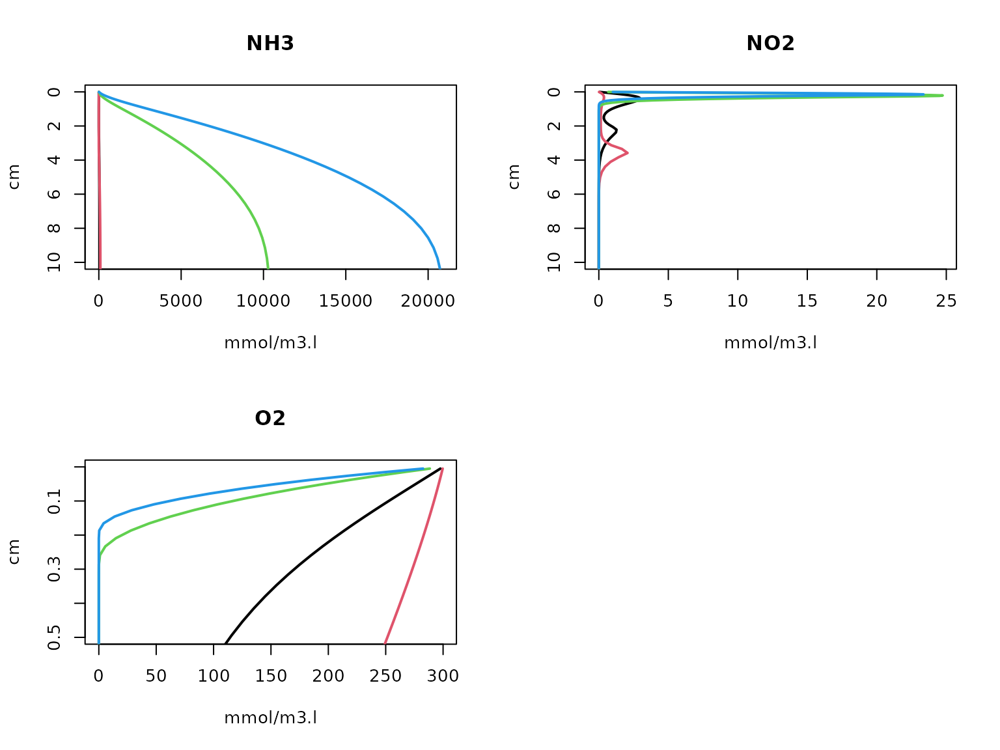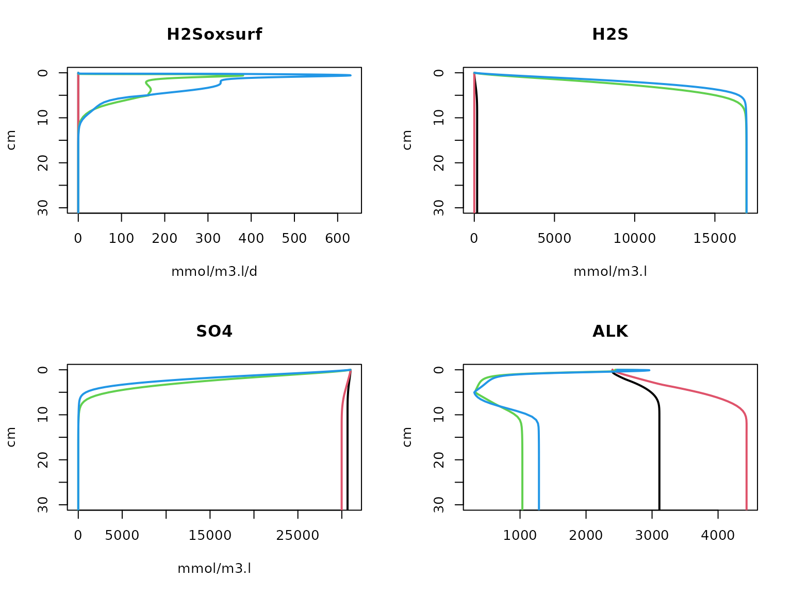

``` r
plot(out2, out3, ylim = c(5, 0), lty = 1, lwd = 2, 
  which = c("H2Soxsurf", "O2distConsump", "FeOH3", "BSRmin"))
```

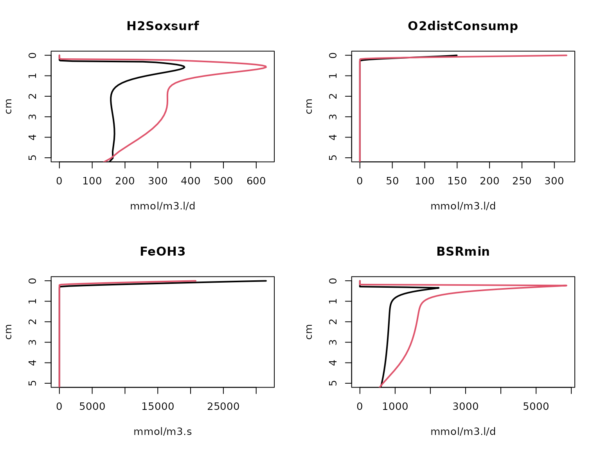

``` r
FESDIAbudgetO2(out0, out1, out2, out3, which = "Fluxes")
#> Warning in rbind(deparse.level, ...): number of columns of result, 1, is not a
#> multiple of vector length 2 of arg 2
#> Warning in rbind(deparse.level, ...): number of columns of result, 1, is not a
#> multiple of vector length 2 of arg 2
#> Warning in rbind(deparse.level, ...): number of columns of result, 1, is not a
#> multiple of vector length 2 of arg 2
#> Warning in rbind(deparse.level, ...): number of columns of result, 1, is not a
#> multiple of vector length 2 of arg 2
#>                    [,1]          [,2]     [,3]     [,4]
#> O2surf     5.069599e+02  7.825278e+01 2495.724 3761.315
#> O2deep    6.453672e-163 1.111724e-195    0.000    0.000
#> O2perturb  0.000000e+00  0.000000e+00    0.000    0.000
#> O2net      5.069599e+02  7.825278e+01 2495.724 3761.315
```

``` r
pH <- cbind(FESDIApH(out2),FESDIApH(out3))
matplot(x = pH, y = FESDIAdepth(out1), ylim = c(2,0), xlim = c(0,10),
        type = "l", main = "pH", lty = 1, lwd = 2, ylab = "depth")
```

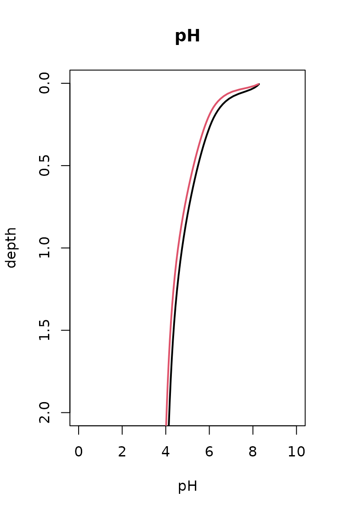

## Dynamic runs with sinusoidal forcing

### Carbon input

In the first dynamic run, a sinusoidal variation in time is used for the
C flux, with amplitude = 1, the other parameters are left equal to the
default.

``` r
DIA <- FESDIAdyna (Cflux = list(amp = 1))
pH  <- FESDIApH(DIA)

image2D(DIA, ylim = c(20, 0), which = c(3:6,8), mfrow = c(3,3))
plot3D:::image2D(pH, y = FESDIAdepth(DIA), ylim = c(20, 0), main = "pH")
matplot.0D(DIA, which = c("OrgCflux", "O2flux"), mfrow = NULL, lty = 1, lwd = 2)
plot(DIA, which = c("NH3flux", "ALKflux"), mfrow = NULL, lwd = 2)
```

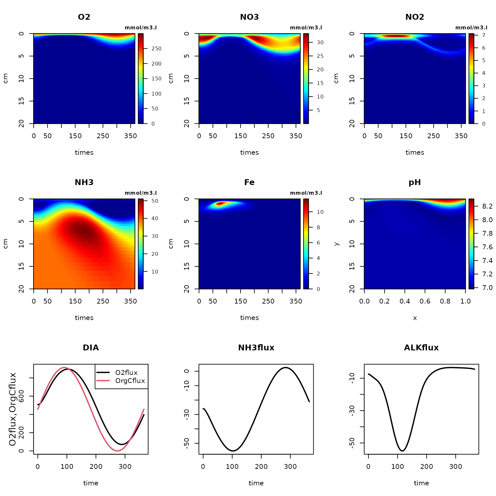

### Microphytobenthos production

#### Seasonal variation

First a model is run with seasonally variable MPB production.

``` r

DIA <- FESDIAdyna (parms = list(MPBprod = 50000, por0 = 0.5),
      MPBprodForc = list(amp = 4, phase = 100), spinup = 0:365)
image2D(DIA, ylim = c(20, 0), which = 3:5, mfrow = c(3,3))
matplot.0D(DIA, which = c("OrgCflux", "O2flux"), mfrow = NULL, lty = 1, lwd = 2)
plot(DIA, which = c("TotO2prod", "TotDenit","ALKflux","NO3flux","PO4flux"), 
  mfrow = NULL, lwd = 2)
```

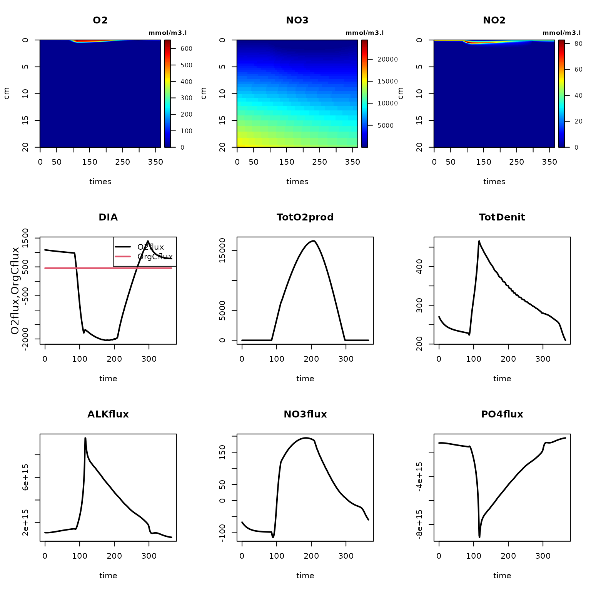

``` r
print(FESDIAbudgetO2(DIA))
#> Warning in rbind(deparse.level, ...): number of columns of result, 1, is not a
#> multiple of vector length 2 of arg 2
#> $Fluxes
#>                     O2
#> surface  -1.570540e+02
#> bottom   1.204545e-134
#> perturb   0.000000e+00
#> netin    -1.570540e+02
#> 
#> $Rates
#>              Nitrification FeOxidation MnOxidation H2Soxidation CH4oxidation
#> nmolO2/cm2/d      993.2219   0.4752545  0.00745074     11.54611     29.12457
#>              H2Soxid.dist CH4oxid.dist OxicMineralisation MPBO2production
#> nmolO2/cm2/d            0            0            4993.73         5942.55
#>              MPBO2respiration    Total
#> nmolO2/cm2/d                0 11970.66
#> 
#> $Losses
#> [1] 1.204545e-134
#> 
#> $dC
#>         O2        sum 
#> 0.01005606 0.01005606 
#> 
#> $Delta
#> [1] -12127.71
#> 
#> $Fluxmat
#>            Ext      O2     NO2      NO3      DIC      SO4     FeOH3       MnO2
#> Ext      0.000    0.00   0.000  0.00000    0.000  0.00000 0.0000000 0.00000000
#> O2     157.054    0.00 938.901 54.32092 5022.855 11.54611 0.4752545 0.00745074
#> NO2      0.000    0.00   0.000  0.00000    0.000  0.00000 0.0000000 0.00000000
#> NO3      0.000    0.00   0.000  0.00000    0.000  0.00000 0.0000000 0.00000000
#> DIC      0.000 5942.55   0.000  0.00000    0.000  0.00000 0.0000000 0.00000000
#> SO4      0.000    0.00   0.000  0.00000    0.000  0.00000 0.0000000 0.00000000
#> FeOH3    0.000    0.00   0.000  0.00000    0.000  0.00000 0.0000000 0.00000000
#> MnO2     0.000    0.00   0.000  0.00000    0.000  0.00000 0.0000000 0.00000000
#> Burial   0.000    0.00   0.000  0.00000    0.000  0.00000 0.0000000 0.00000000
#>               Burial
#> Ext     0.000000e+00
#> O2     1.204545e-134
#> NO2     0.000000e+00
#> NO3     0.000000e+00
#> DIC     0.000000e+00
#> SO4     0.000000e+00
#> FeOH3   0.000000e+00
#> MnO2    0.000000e+00
#> Burial  0.000000e+00
```

#### Diurnal variation

A run with daily variable MPB production:

``` r
INI <- FESDIAsolve (parms = list(por0 = 0.5))

DIA <- FESDIAdyna (parms = list(MPBprod = 10000, por0 = 0.5), 
                   MPBprodForc = list(amp = 4, period = 1), 
                   spinup = seq(0, 10, length.out = 1000), yini = INI$y,
                   times = seq(0, 3,length.out = 100))
PH <- FESDIApH(DIA)
image2D(DIA, ylim = c(5, 0), which = 3:5, mfrow = c(3,3))
matplot.0D(DIA, which = c("OrgCflux", "O2flux"), mfrow = NULL, lty = 1, lwd = 2)
plot(DIA, which = c("TotO2prod", "TotDenit","ALKflux","NO3flux","PO4flux"), mfrow = NULL, lwd = 2)
```

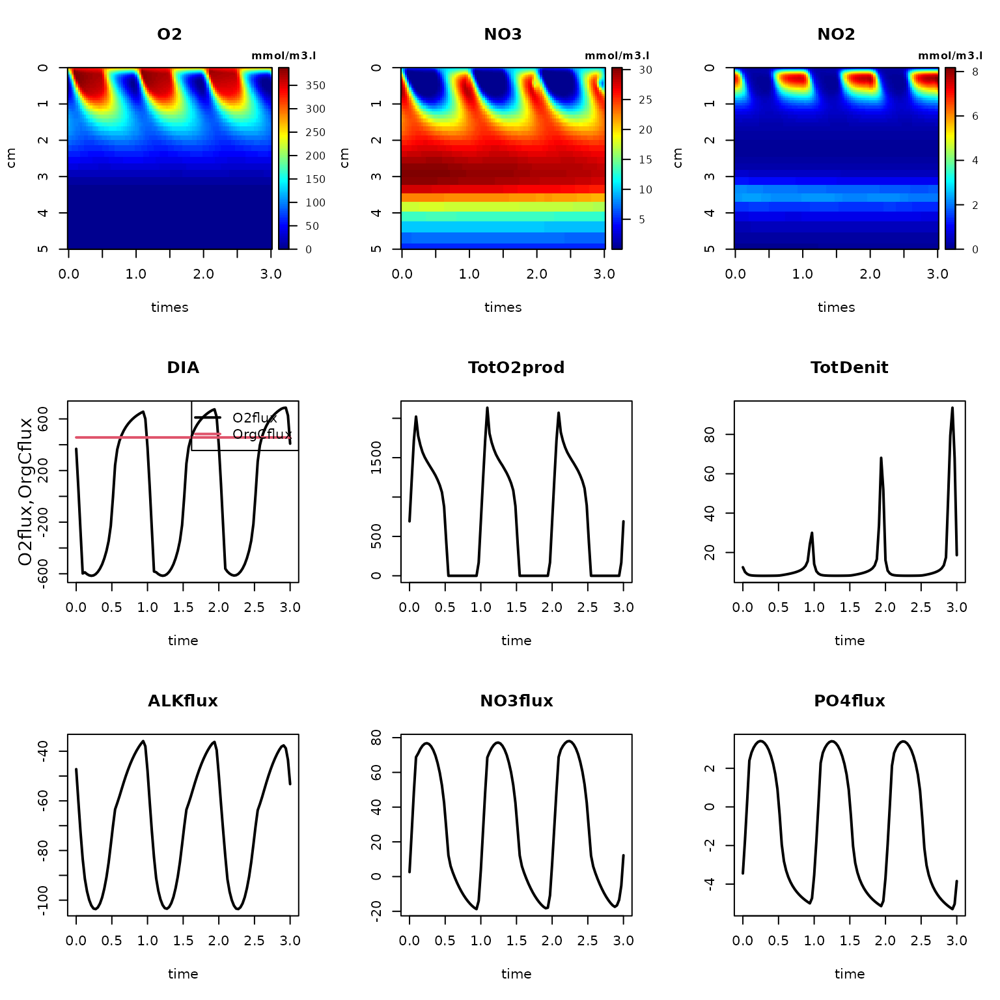

``` r
print(FESDIAbudgetO2(DIA))
#> Warning in rbind(deparse.level, ...): number of columns of result, 1, is not a
#> multiple of vector length 2 of arg 2
#> $Fluxes
#>                    O2
#> surface  3.689199e+01
#> bottom  2.444655e-138
#> perturb  0.000000e+00
#> netin    3.689199e+01
#> 
#> $Rates
#>              Nitrification FeOxidation MnOxidation H2Soxidation CH4oxidation
#> nmolO2/cm2/d      90.42107   0.3237276  0.03491646     7.510954   0.02037584
#>              H2Soxid.dist CH4oxid.dist OxicMineralisation MPBO2production
#> nmolO2/cm2/d            0            0           799.9694        736.4762
#>              MPBO2respiration    Total
#> nmolO2/cm2/d                0 1634.757
#> 
#> $Losses
#> [1] 2.444655e-138
#> 
#> $dC
#>        O2       sum 
#> -8.348012 -8.348012 
#> 
#> $Delta
#> [1] -1597.865
#> 
#> $Fluxmat
#>        Ext        O2      NO2      NO3      DIC      SO4     FeOH3       MnO2
#> Ext      0  36.89199  0.00000  0.00000   0.0000 0.000000 0.0000000 0.00000000
#> O2       0   0.00000 71.44932 18.97175 799.9898 7.510954 0.3237276 0.03491646
#> NO2      0   0.00000  0.00000  0.00000   0.0000 0.000000 0.0000000 0.00000000
#> NO3      0   0.00000  0.00000  0.00000   0.0000 0.000000 0.0000000 0.00000000
#> DIC      0 736.47620  0.00000  0.00000   0.0000 0.000000 0.0000000 0.00000000
#> SO4      0   0.00000  0.00000  0.00000   0.0000 0.000000 0.0000000 0.00000000
#> FeOH3    0   0.00000  0.00000  0.00000   0.0000 0.000000 0.0000000 0.00000000
#> MnO2     0   0.00000  0.00000  0.00000   0.0000 0.000000 0.0000000 0.00000000
#> Burial   0   0.00000  0.00000  0.00000   0.0000 0.000000 0.0000000 0.00000000
#>               Burial
#> Ext     0.000000e+00
#> O2     2.444655e-138
#> NO2     0.000000e+00
#> NO3     0.000000e+00
#> DIC     0.000000e+00
#> SO4     0.000000e+00
#> FeOH3   0.000000e+00
#> MnO2    0.000000e+00
#> Burial  0.000000e+00
```

### Microphytobenthos production with sediments falling dry

Sediments are imposed to be exposed to the air by giving *gasfluxForc* a
value other than 0, as in following example.

``` r
F <- 1e3
gasflux <- data.frame(time = c(0, 0.19999, 0.2, 0.6, 0.6661, 1.19999, 1.2, 1.6, 1.6661, 2.19999, 2.2, 2.6, 2.6661, 3),
                flux = c(0,  0,      F,   F,   0,      0      , F,   F,   0,      0      ,F,   F,   0,      0      ))
DIA <- FESDIAdyna (parms = list(MPBprod = 10000), 
             MPBprodForc = list(amp = 4, period = 1), gasfluxForc = list(data = gasflux),
             spinup = seq(0, 3, length.out = 100), times = seq(0, 3, length.out = 100))
image2D(DIA, ylim = c(5, 0), which = c(3:5,10),  mfrow = c(3,4))
matplot.0D(DIA, which = c("OrgCflux", "O2flux"), mfrow = NULL, lty = 1, lwd = 2)
plot(DIA, which = c("TotO2prod", "TotDenit","NO3flux","PO4flux","DICflux","H2Sflux","ALKflux"), mfrow = NULL, lwd = 2)
```

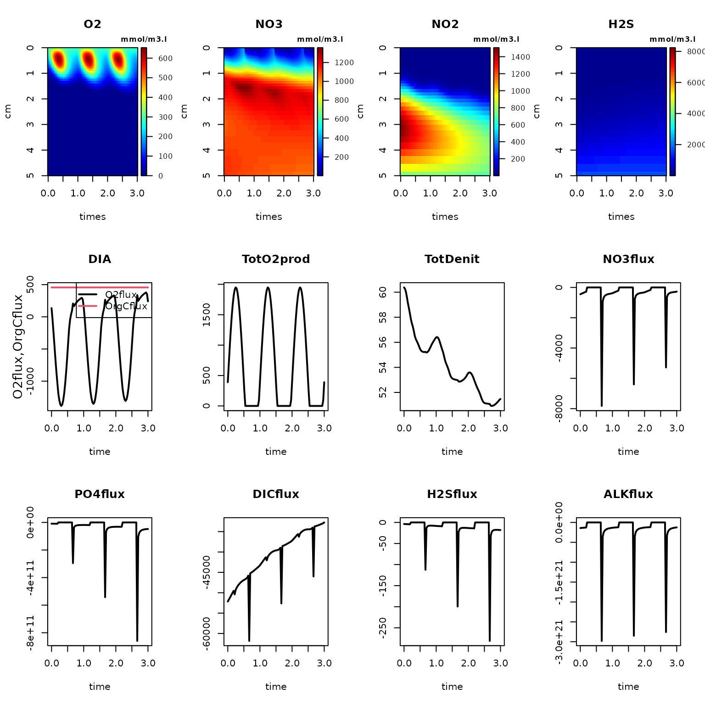

``` r
print(FESDIAbudgetO2(DIA))
#> Warning in rbind(deparse.level, ...): number of columns of result, 1, is not a
#> multiple of vector length 2 of arg 2
#> $Fluxes
#>                     O2
#> surface  -3.451068e+02
#> bottom   5.860291e-161
#> perturb   0.000000e+00
#> netin    -3.451068e+02
#> 
#> $Rates
#>              Nitrification FeOxidation MnOxidation H2Soxidation CH4oxidation
#> nmolO2/cm2/d      207.7184    8.962435    1.191703     26.02317 5.180133e-05
#>              H2Soxid.dist CH4oxid.dist OxicMineralisation MPBO2production
#> nmolO2/cm2/d            0            0           315.5298        707.3853
#>              MPBO2respiration    Total
#> nmolO2/cm2/d                0 1266.811
#> 
#> $Losses
#> [1] 5.860291e-161
#> 
#> $dC
#>       O2      sum 
#> 8.640472 8.640472 
#> 
#> $Delta
#> [1] -1611.918
#> 
#> $Fluxmat
#>             Ext       O2      NO2      NO3      DIC      SO4    FeOH3     MnO2
#> Ext      0.0000   0.0000  0.00000   0.0000   0.0000  0.00000 0.000000 0.000000
#> O2     345.1068   0.0000 50.44412 157.2743 315.5298 26.02317 8.962435 1.191703
#> NO2      0.0000   0.0000  0.00000   0.0000   0.0000  0.00000 0.000000 0.000000
#> NO3      0.0000   0.0000  0.00000   0.0000   0.0000  0.00000 0.000000 0.000000
#> DIC      0.0000 707.3853  0.00000   0.0000   0.0000  0.00000 0.000000 0.000000
#> SO4      0.0000   0.0000  0.00000   0.0000   0.0000  0.00000 0.000000 0.000000
#> FeOH3    0.0000   0.0000  0.00000   0.0000   0.0000  0.00000 0.000000 0.000000
#> MnO2     0.0000   0.0000  0.00000   0.0000   0.0000  0.00000 0.000000 0.000000
#> Burial   0.0000   0.0000  0.00000   0.0000   0.0000  0.00000 0.000000 0.000000
#>               Burial
#> Ext     0.000000e+00
#> O2     5.860291e-161
#> NO2     0.000000e+00
#> NO3     0.000000e+00
#> DIC     0.000000e+00
#> SO4     0.000000e+00
#> FeOH3   0.000000e+00
#> MnO2    0.000000e+00
#> Burial  0.000000e+00
```

## dynamic runs with forcing function time series

### Carbon flux and bottom water concentrations

We can also impose a time-series. Here we impose this for the carbon
flux, and for the Oxygen bottom water concentration.

``` r
fluxforcdat <- data.frame(time = c(0, 100, 101, 200, 201, 365),
                          flux = c(20, 20, 100, 100, 20, 20)*1e5/12/365)
O2forcdat <- data.frame(time = c(0, 100, 101, 200, 201, 365),
                        conc = c(200, 200, 10, 10, 200, 200))
DIA <- FESDIAdyna (CfluxForc = list(data = fluxforcdat), 
                   O2bwForc = list(data = O2forcdat), spinup = 0:365)
image2D(DIA,  which = 3:8, mfrow = c(3,3))
matplot.0D(DIA, which = c("OrgCflux", "O2flux"), mfrow = NULL, lty = 1, lwd = 2, main = "Fluxes")
plot(DIA, which = c("bwO2","NH3flux"), mfrow = NULL, lwd = 2)
```

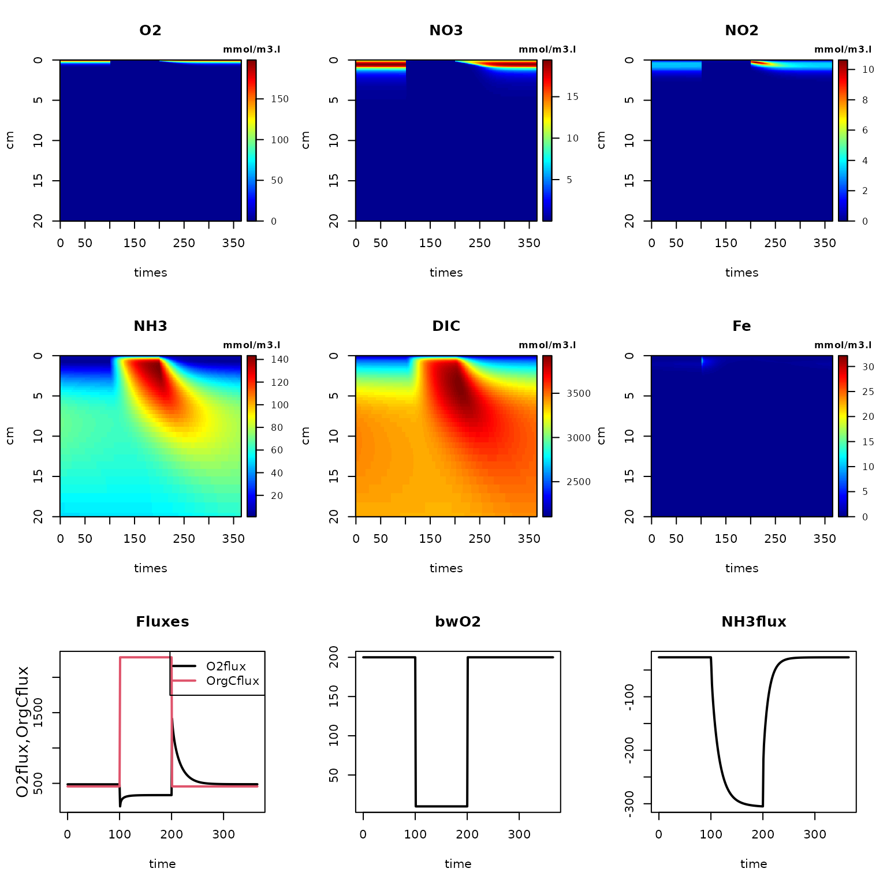

### Flux and sedimentation rates

Other variables that can be forced are *w*, *biot*, *irr* for the
sedimentation rate, bioturbation rate and irrigation rates respectively,
microphytobenthos production, …

``` r
fluxforcdat <- data.frame(time = c(0, 100, 101, 200, 201, 365),
                          flux = c(20, 20, 100, 100, 20, 20)*1e5/12/365)
seddat <- data.frame(time = c(0, 100, 101, 200, 201, 365),
                     w = c(0.1, 0.1, 10, 10, 0.1, 0.1)/365)  #cm/d
DIA <- FESDIAdyna (CfluxForc = list(data = fluxforcdat), 
                   wForc = list(data = seddat), 
                   spinup = 0:365)
image2D(DIA, ylim = c(20, 0), which = 3:8, mfrow = c(3,3))
matplot.0D(DIA, which = c("OrgCflux", "O2flux"), mfrow = NULL, lty = 1, lwd = 2, main = "Fluxes")
plot(DIA, which = c("w", "NH3flux"), mfrow = NULL, lwd = 2)
```

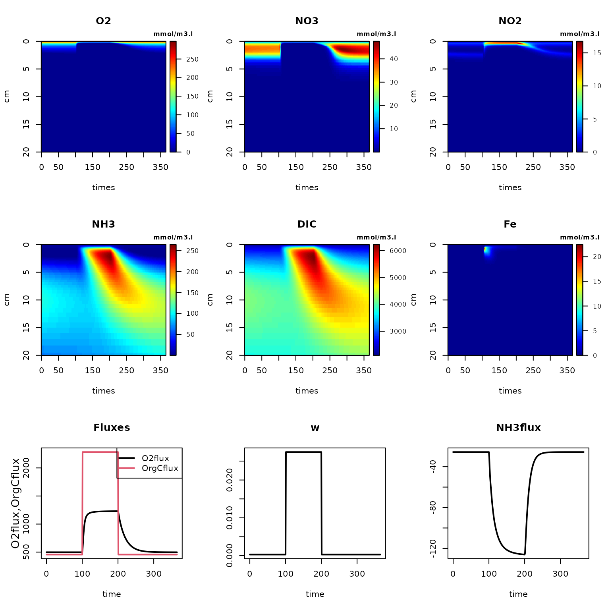

### Deposition-erosion rates.

Particles often go through a repeated deposition-erosion cycle. In the
first case, sedimation rates, w is positive, and there is solid
deposition; in the latter case, *w* is negative and there is no carbon
deposition, *Cdepo*.

``` r
FF <- c(20, 30, 20, 10, 0, 0, 0, 0, 0, 0)*1e5/12/365
SS <- c(0.2, 0.2, 0.2, 0.1, 0.0,-0.1,-0.2,-0.2,-0.1, 0)  #cm/d
FF <- rep(FF, times = 10)
Fluxforcdat <- data.frame(time = seq(0, to = 39.8, length.out = length(FF)), 
                          flux = FF)

SS <- rep(SS, times = 10)
Seddat <- data.frame(time = seq(0, to = 39.8, length.out = length(SS)), 
                     w = SS)

times <- seq(0, 19, length.out = 300)

P <- list(Cflux = FF[1], w = SS[1])
std <- FESDIAsolve(parms = P)
DIA <- FESDIAdyna (wForc = list(data = Seddat), times = times, spinup = times,
                    yini = std$y)
```

``` r
image2D(DIA, ylim = c(15, 0), which = 3:8, mfrow = c(3,3))
matplot.0D(DIA, which = c("OrgCflux", "O2flux"), mfrow = NULL, lty = 1, lwd = 2, main = "Fluxes")
plot(DIA, which = c("w","NH3flux"), mfrow = NULL, lwd = 2)
```

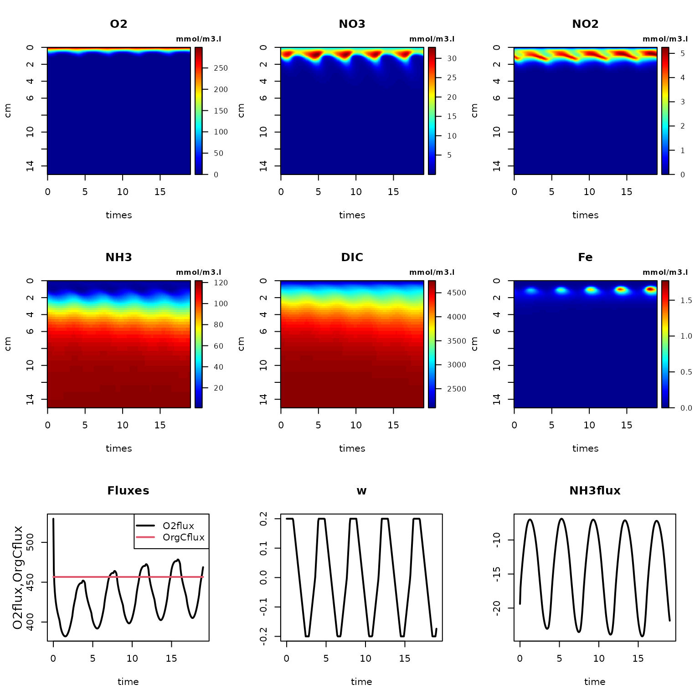

In the second run both the sedimentation rate and the carbon flux
fluctuate.

``` r
DIA2 <- FESDIAdyna (CfluxForc = list(data = Fluxforcdat), wForc = list(data = Seddat),
                    times = times, spinup = times, yini = std$y)
```

``` r
image2D(DIA2, ylim = c(15, 0), which = 3:8, mfrow = c(3,3))
matplot.0D(DIA2, which = c("OrgCflux", "O2flux"), mfrow = NULL, lty = 1, lwd = 2, main = "Fluxes")
plot(DIA2, which = c("w", "NH3flux"), mfrow = NULL, lwd = 2)
```

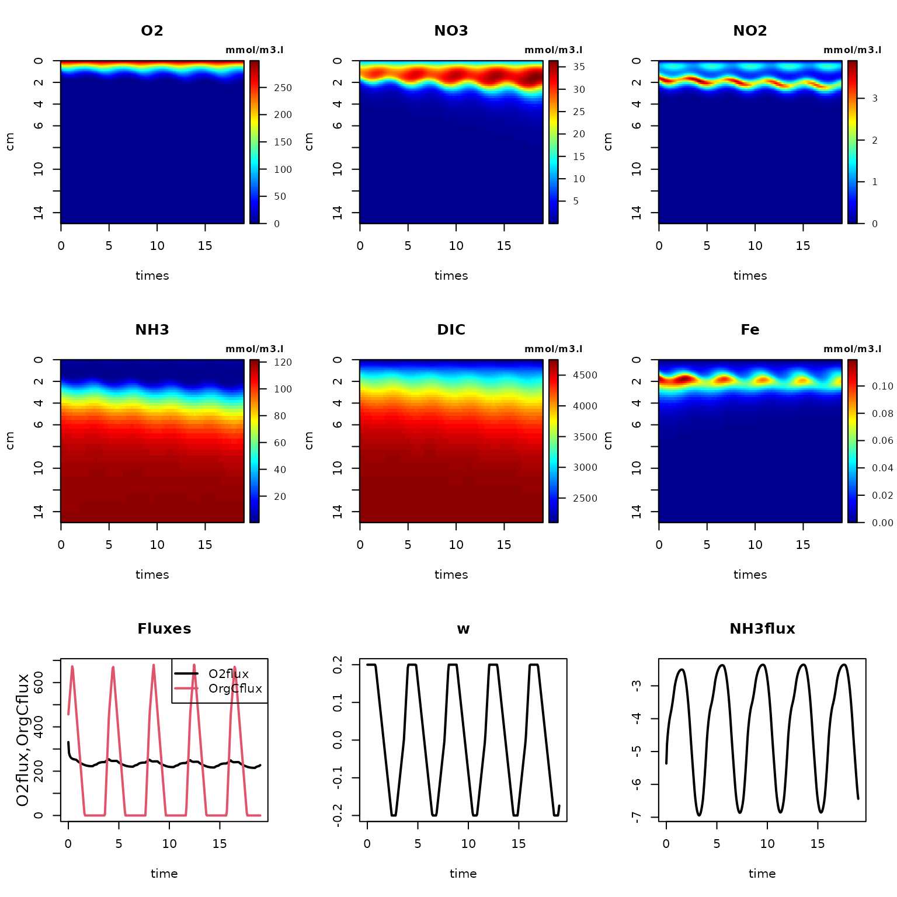

``` r

print(FESDIAbudgetC(DIA, DIA2))
#> Warning in rbind(deparse.level, ...): number of columns of result, 7, is not a
#> multiple of vector length 4 of arg 2
#> Warning in rbind(deparse.level, ...): number of columns of result, 7, is not a
#> multiple of vector length 4 of arg 2
#> $Fluxes
#>                         [,1]           [,2]
#> FDETsurf        4.109589e+02   1.695465e+02
#> FDETdeep        3.866338e-10   3.866337e-10
#> FDETperturb     0.000000e+00   0.000000e+00
#> FDETnet         4.109589e+02   1.695465e+02
#> SDETsurf        4.566210e+01   1.883850e+01
#> SDETdeep        2.481954e+00   2.481954e+00
#> SDETperturb     0.000000e+00   0.000000e+00
#> SDETnet         4.318015e+01   1.635655e+01
#> DICsurf        -4.200249e+02  -2.337243e+02
#> DICdeep         2.770354e+01   2.770354e+01
#> DICperturb      0.000000e+00   0.000000e+00
#> DICnet         -4.477284e+02  -2.614279e+02
#> CH4surf        -3.823412e-08  -1.345484e-08
#> CH4deep         5.290819e-06   5.290819e-06
#> CH4perturb      0.000000e+00   0.000000e+00
#> CH4net         -5.329053e-06  -5.304273e-06
#> CinCaPsurf      0.000000e+00   0.000000e+00
#> CinCaPdeep     2.648376e-183  2.648264e-183
#> CinCaPperturb   0.000000e+00   0.000000e+00
#> CinCaPnet     -2.648376e-183 -2.648264e-183
#> CaCO3surf       0.000000e+00   0.000000e+00
#> CaCO3deep       0.000000e+00   0.000000e+00
#> CaCO3perturb    0.000000e+00   0.000000e+00
#> CaCO3net        0.000000e+00   0.000000e+00
#> ARAGsurf        0.000000e+00   0.000000e+00
#> ARAGdeep        0.000000e+00   0.000000e+00
#> ARAGperturb     0.000000e+00   0.000000e+00
#> ARAGnet         0.000000e+00   0.000000e+00
#> Totalsurf       3.659614e+01  -4.533927e+01
#> Totaldeep       3.018550e+01   3.018550e+01
#> Totalperturb    0.000000e+00   0.000000e+00
#> Totalnet        6.410644e+00  -7.552477e+01
#> 
#> $Rates
#>                             [,1]         [,2]
#> OxicMineralisation  339.50394002 1.675573e+02
#> Denitrification      21.68023294 1.160164e+01
#> ManganeseReduction    0.14238568 1.166096e-02
#> IronReduction         0.07478364 3.856871e-03
#> SulphateReduction    51.10356165 3.044039e+01
#> Methanogenesis        1.62640541 9.620465e-01
#> TotalMineralisation 414.13130935 2.105769e+02
#> CH4oxidation          0.12842234 3.335521e-02
#> MnCO3precitation      0.39519145 2.194468e-01
#> CH4oxid.dist          0.00000000 0.000000e+00
#> CH4oxidAOM            0.71741913 4.859596e-01
#> MPBDICuptake          0.00000000 0.000000e+00
#> MPBFDETproduction     0.00000000 0.000000e+00
#> MPBResp               0.00000000 0.000000e+00
#> CaPprecipitation      0.00000000 0.000000e+00
#> CaPdissolution        0.00000000 0.000000e+00
#> CaCO3dissolution      0.00000000 0.000000e+00
#> ARAGdissolution       0.00000000 0.000000e+00
#> CaCO3production       0.00000000 0.000000e+00
#> 
#> $Losses
#>         [,1]    [,2]
#> [1,] 30.1855 30.1855
#> 
#> $dC
#>               [,1]           [,2]
#> DET   4.000774e+01  -2.465790e+01
#> DIC  -3.431892e+01  -5.121033e+01
#> CaP -9.229484e-183 -9.229156e-183
#> CH4  -3.265104e-02  -3.830391e-02
#> sum   5.656173e+00  -7.590654e+01
#> 
#> $Delta
#>          [,1]      [,2]
#> [1,] 6.410644 -75.52477
```

## Dynamic runs with explicitly modeled bottom water conditions

### Incubation experiments

The simulation is initiated with the steady-state conditions, while
keeping the bottom water conditions constant.

``` r
std <- FESDIAsolve(dynamicbottomwater = FALSE, parms = list(Cflux = 20*1e5/12/365))
FESDIAbudgetO2(std, which = "Fluxes")
#> Warning in rbind(deparse.level, ...): number of columns of result, 1, is not a
#> multiple of vector length 2 of arg 2
#>                    O2
#> surface  5.069599e+02
#> bottom  6.966657e-163
#> perturb  0.000000e+00
#> netin    5.069599e+02
```

The initial conditions for the dynamic bottom water concentration run
needs to have the bottom water concentrations as the first row.

The model is run for two days.

``` r
P <- FESDIAparms(std, as.vector = TRUE)[c("O2bw", "NO3bw", "NO2bw", "NH3bw", "DICbw", "Febw", "H2Sbw", "SO4bw", "CH4bw", "PO4bw", "ALKbw")]

# order of state variables, FDET,SDET,O2,NO3,NO2,NH3,DIC,Fe,FeOH3,H2S,SO4,CH4,PO4,FeP,CaP,Pads,ALK
BW <- c(0, 0, P[c("O2bw","NO3bw","NO2bw","NH3bw","DICbw","Febw")], 0, P[c("H2Sbw","SO4bw","CH4bw","PO4bw")], 0, 0, 0, P["ALKbw"])  
dyn <- FESDIAdyna(dynamicbottomwater = TRUE, yini = rbind(BW, std$y), 
      parms = list(Cflux = 20*1e5/12/365), times = seq(0, 2, length.out = 100))
#> Warning in rbind(BW, std$y): number of columns of result is not a multiple of
#> vector length (arg 1)
```

``` r
image2D(dyn, which = c("O2", "NO3", "NH3","CH4"), ylim = c(10,0))
```

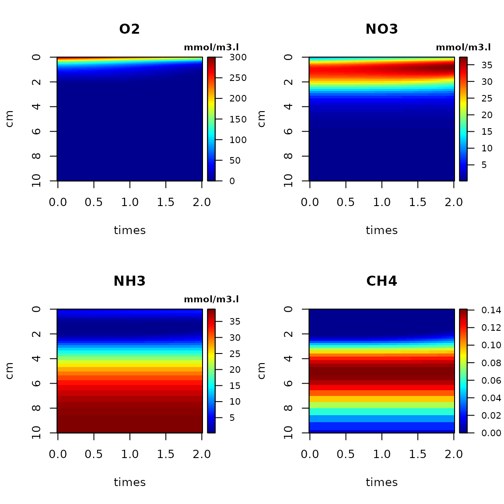

``` r
plot(dyn, which = c("O2bw","NO3bw","NH3bw","CH4bw","PO4bw","H2Sbw"))
```


``` r
plot(dyn, which = c("O2flux","NO3flux","NH3flux","CH4flux","PO4flux","H2Sflux"))
```


## Perturbation runs

See vignette (“FESDIAperturb”)

## References

Soetaert K, PMJ Herman and JJ Middelburg, 1996a. A model of early
diagenetic processes from the shelf to abyssal depths. Geochimica
Cosmochimica Acta, 60(6):1019-1040.

Soetaert K, PMJ Herman and JJ Middelburg, 1996b. Dynamic response of
deep-sea sediments to seasonal variation: a model. Limnol. Oceanogr.
41(8): 1651-1668.

## APPENDIX

### Parameters and default values.

``` r
knitr:::kable(FESDIAparms())
```

|               |        parms | units         | description                                              |
|:--------------|-------------:|:--------------|:---------------------------------------------------------|
| Cflux         | 4.566210e+02 | nmolC/cm2/d   | total organic C deposition                               |
| pFast         | 9.000000e-01 | \-            | part FDET in carbon flux                                 |
| FeOH3flux     | 1.000000e+00 | nmol/cm2/d    | deposition rate of FeOH3                                 |
| CaPflux       | 0.000000e+00 | nmol/cm2/d    | deposition rate of CaP                                   |
| rFast         | 6.849320e-02 | /d            | decay rate FDET                                          |
| rSlow         | 1.370000e-04 | /d            | decay rate SDET                                          |
| NCrFdet       | 1.509434e-01 | molN/molC     | NC ratio FDET                                            |
| NCrSdet       | 1.509434e-01 | molN/molC     | NC ratio SDET                                            |
| PCrFdet       | 9.434000e-03 | molP/molC     | PC ratio FDET                                            |
| PCrSdet       | 9.434000e-03 | molP/molC     | PC ratio SDET                                            |
| BCupLiq       | 2.000000e+00 | \-            | upper boundary liq. 1:flux, 2:conc, 3:0-grad             |
| BCdownLiq     | 3.000000e+00 | \-            | lower boundary liq. 1:flux, 2:conc, 3:0-grad             |
| O2bw          | 3.000000e+02 | mmol/m3       | upper boundary O2 -if BC=1: flux, 2:conc                 |
| NO3bw         | 1.000000e+01 | mmol/m3       | upper boundary NO3 -if BC=1: flux, 2:conc                |
| NO2bw         | 0.000000e+00 | mmol/m3       | upper boundary NO2 -if BC=1: flux, 2:conc                |
| NH3bw         | 1.000000e+00 | mmol/m3       | upper boundary NH3 -if BC=1: flux, 2:conc                |
| CH4bw         | 0.000000e+00 | mmol/m3       | upper boundary CH4 -if BC=1: flux, 2:conc                |
| PO4bw         | 5.000000e-01 | mmol/m3       | upper boundary PO4 -if BC=1: flux, 2:conc                |
| DICbw         | 2.100000e+03 | mmol/m3       | upper boundary DIC -if BC=1: flux, 2:conc                |
| Febw          | 0.000000e+00 | mmol/m3       | upper boundary Fe2+ -if BC=1: flux, 2:conc               |
| H2Sbw         | 0.000000e+00 | mmol/m3       | upper boundary H2S -if BC=1: flux, 2:conc                |
| SO4bw         | 3.100000e+04 | mmol/m3       | upper boundary SO4 -if BC=1: flux, 2:conc                |
| ALKbw         | 2.400000e+03 | mmol/m3       | upper boundary alkalinity -if BC=1: flux, 2:conc         |
| Mnbw          | 0.000000e+00 | mmol/m3       | upper boundary Manganese -if BC=1: flux, 2:conc          |
| O2dw          |           NA | mmol/m3       | lower boundary O2 -if BC=1: flux, 2:conc                 |
| NO3dw         |           NA | mmol/m3       | lower boundary NO3 -if BC=1: flux, 2:conc                |
| NO2dw         |           NA | mmol/m3       | lower boundary NO2 -if BC=1: flux, 2:conc                |
| NH3dw         |           NA | mmol/m3       | lower boundary NH3 -if BC=1: flux, 2:conc                |
| CH4dw         |           NA | mmol/m3       | lower boundary CH3 -if BC=1: flux, 2:conc                |
| PO4dw         |           NA | mmol/m3       | lower boundary PO4 -if BC=1: flux, 2:conc                |
| DICdw         |           NA | mmol/m3       | lower boundary DIC -if BC=1: flux, 2:conc                |
| Fedw          |           NA | mmol/m3       | lower boundary Fe2+ -if BC=1: flux, 2:conc               |
| H2Sdw         |           NA | mmol/m3       | lower boundary H2S -if BC=1: flux, 2:conc                |
| SO4dw         |           NA | mmol/m3       | lower boundary SO4 -if BC=1: flux, 2:conc                |
| ALKdw         |           NA | mmol/m3       | lower boundary alkalinity -if BC=1: flux, 2:conc         |
| Mndw          |           NA | mmol/m3       | lower boundary Mangenese -if BC=1: flux, 2:conc          |
| w             | 2.700000e-06 | cm/d          | advection rate                                           |
| biot          | 2.739700e-03 | cm2/d         | bioturbation coefficient                                 |
| biotdepth     | 5.000000e+00 | cm            | depth of mixed layer                                     |
| biotatt       | 1.000000e+00 | /cm           | attenuation coeff below biotdepth                        |
| irr           | 0.000000e+00 | /d            | bio-irrigation rate                                      |
| irrdepth      | 5.000000e+00 | cm            | depth of irrigated layer                                 |
| irratt        | 1.000000e+00 | cm            | attenuation coeff below irrdepth                         |
| gasflux       | 0.000000e+00 | cm/d          | piston velocity for dry flats                            |
| NH3Ads        | 1.300000e+00 | \-            | Adsorption coeff ammonium                                |
| rnitri1       | 2.000000e+01 | /d            | Max nitrification rate step1 (NH3ox)                     |
| rnitri2       | 2.000000e+01 | /d            | Max nitrification rate step2 (NO2ox)                     |
| ranammox      | 1.000000e-01 | /(mmol/m3)/d  | Anammox rate                                             |
| ksO2nitri     | 1.000000e+00 | mmolO2/m3     | half-sat O2 in nitrification                             |
| ksO2oxic      | 3.000000e+00 | mmolO2/m3     | half-sat O2 in oxic mineralisation                       |
| ksNO3denit    | 3.000000e+01 | mmolNO3/m3    | half-sat NO3 in denitrification                          |
| kinO2denit    | 1.000000e+00 | mmolO2/m3     | half-sat O2 inhib denitrification                        |
| kinNO3anox    | 1.000000e+00 | mmolNO3/m3    | half-sat NO3 inhib anoxic degr                           |
| kinO2anox     | 1.000000e-03 | mmolO2/m3     | half-sat O2 inhib anoxic min                             |
| temperature   | 1.000000e+01 | dgC           | temperature                                              |
| salinity      | 3.500000e+01 | psu           | salinity                                                 |
| TOC0          | 5.000000e-01 | %             | refractory Carbon conc                                   |
| rFePadsorp    | 1.000000e-06 | /d            | rate FeP adsorption                                      |
| rCaPprod      | 0.000000e+00 | /d            | rate CaP production                                      |
| rCaPdiss      | 0.000000e+00 | /d            | rate CaP dissolution                                     |
| CPrCaP        | 2.869565e-01 | mol/mol       | C:Pratio in CaP                                          |
| rPads         | 0.000000e+00 | /d            | adsorption rate PO4                                      |
| rPdes         | 0.000000e+00 | /d            | desorption rate of adsorbed P                            |
| maxPads       | 1.000000e+03 | mmolP/m3solid | Max adsorbed P concentration                             |
| ksFeOH3       | 1.250000e+04 | mmolFeOH3/m3  | half-sat FeOH3 conc in iron reduction                    |
| kinFeOH3      | 1.250000e+04 | mmolFeOH3/m3  | half-sat FeOH3 inhibition S reduction                    |
| ksSO4BSR      | 1.600000e+03 | mmolS/m3      | half-sat SO4 conc in sulphate reduction                  |
| kinSO4Met     | 1.000000e+03 | mmolS/m3      | half-sat SO4 inhibition methanogenesis                   |
| rFeox         | 3.000000e-01 | /(mmol/m3)/d  | Max rate Fe oxidation                                    |
| rH2Sox        | 5.000000e-04 | /(mmol/m3)/d  | Max rate H2S oxidation                                   |
| rFeS          | 1.000000e-03 | /(mmol/m3)/d  | maximum rate FeS production                              |
| rCH4ox        | 2.700000e+01 | /(mmol/m3)/d  | Max rate CH4 oxidation with O2                           |
| rAOM          | 3.000000e-05 | /(mmol/m3)/d  | Max rate anaerobic oxidation Methane                     |
| rSurfH2Sox    | 0.000000e+00 | /d            | Max rate H2S oxidation with BW O2                        |
| rSurfCH4ox    | 0.000000e+00 | /d            | Max rate CH4 oxidation with BW O2                        |
| ksSurfALK     | 3.000000e+03 | mmol/m3       | half-sat Alkalinity in oxidation of H2S/CH4 with bwO2    |
| ksO2reox      | 1.000000e+00 | mmolO2/m3     | half-sat Oxygen in oxidation of H2S/CH4 with bwO2        |
| ODUoxdepth    | 5.000000e+00 | cm            | Max depth H2S/CH4 oxidation with BW O2                   |
| ODUoxatt      | 1.000000e+00 | /cm           | depth attenuation ODU oxidation                          |
| por0          | 9.000000e-01 | \-            | surface porosity                                         |
| pordeep       | 5.000000e-01 | \-            | deep porosity                                            |
| porcoeff      | 3.000000e-01 | cm            | porosity decay coefficient                               |
| formationtype | 1.000000e+00 | \-            | formationfactor, 1=sand,2=fine sand,3=general            |
| dilution      | 0.000000e+00 | /d            | relaxation towards background conc                       |
| Hwater        | 1.000000e+01 | cm            | height of water over core                                |
| Cfall         | 1.000000e+02 | cm/d          | fall speed of organic C (FDET, SDET)                     |
| FePfall       | 1.000000e+02 | cm/d          | fall speed of FeP                                        |
| FeOH3fall     | 1.000000e+02 | cm/d          | fall speed of FeOH3                                      |
| CaPfall       | 1.000000e+02 | cm/d          | fall speed of CaP                                        |
| addalk        | 1.000000e+00 | \-            | solve for alkalinity                                     |
| MPBprod       | 0.000000e+00 | mmol/m3/d     | maximal MPB production rate                              |
| kMPB          | 4.000000e+00 | /cm           | sedimentary light extinction coefficient                 |
| kDINupt       | 1.000000e-02 | mmol/m3       | DIN limitation constant MPB                              |
| kPO4upt       | 1.000000e-03 | mmol/m3       | P limitation constant MPB                                |
| kDICupt       | 1.000000e+00 | mmol/m3       | C limitation constant MPB                                |
| rH2Sfeox      | 1.200000e-04 | cm3/nmol/d    | Rate of Sulphide-mediated iron reduction (oxyhydr)oxides |
| MnO2flux      | 1.000000e+00 | nmol/cm2/d    | Flux of Mn Oxides                                        |
| rAgeFeox      | 1.555200e-03 | cm3/nmol/d    | Ageing of FeOx=A                                         |
| rMnOxid       | 8.640000e-04 | cm3/nmol/d    | Rate of Reoxidation of Mn by Oxygen                      |
| rH2SMnox      | 1.728000e-04 | cm3/nmol/d    | Rate of Reoxidation of H2S by MnOx                       |
| rAgeMnox      | 4.665600e-03 | cm3/nmol/d    | Ageing of MnOx=A                                         |
| rMnFe         | 6.500000e-06 | cm3/nmol/d    | Rate of Reoxidation of Fe with MnOx                      |
| rMnS          | 1.000000e-05 | cm3/nmol/d    | Rate of MnS formation                                    |
| rMnCO3prec    | 3.000000e-04 | cm3/nmol/d    | Rate of MnCO3 formation                                  |
| rFeCO3prec    | 3.000000e-04 | cm3/nmol/d    | Rate of FeCO3 formation                                  |
| ksMnO2        | 2.600000e+03 | mmol/m3       | Half saturation constant for Mn red                      |
| pFastFeOx     | 5.000000e-01 | \-            | fraction fast FeOH3 in flux                              |
| pFastMnOx     | 5.000000e-01 | \-            | fraction fast MnO2 in flux                               |
| kinMnO2       | 2.600000e+03 | mmol/m3       | Inhibition of iron and other by MnO2                     |
| isDICcorr     | 0.000000e+00 | \-            | DIC correction for Calcite precip - Rassmann et al 2020  |

### State variables

``` r
knitr:::kable(FESDIAsvar())
```

| names  | units             | description                         |
|:-------|:------------------|:------------------------------------|
| FDET   | mmolC/m3 solid    | Fast decaying Detritus (solid)      |
| SDET   | mmolC/m3 solid    | Slow decaying Detritus (solid)      |
| O2     | mmolO/m3 liquid   | Oxygen (liquid)                     |
| NO3    | mmolN/m3 liquid   | Nitrate (liquid)                    |
| NO2    | mmolN/m3 liquid   | Nitrite (liquid)                    |
| NH3    | mmolN/m3 liquid   | Ammonium/ammonia (liquid)           |
| DIC    | mmolC/m3 liquid   | Dissolved Inorganic Carbon (liquid) |
| Fe     | mmolFe/m3 liquid  | Fe2+ (liquid)                       |
| FeOH3  | mmolFe/m3 solid   | Fe-oxide (solid)                    |
| H2S    | mmolS/m3 liquid   | Sulphide (liquid)                   |
| SO4    | mmolS/m3 liquid   | Sulphate (liquid)                   |
| CH4    | mmolCH4/m3 liquid | Methane (liquid)                    |
| PO4    | mmolP/m3 liquid   | Phosphate (liquid)                  |
| FeP    | mmolP/m3 solid    | Iron-bound P (solid)                |
| CaP    | mmolP/m3 solid    | Ca-bound P (solid)                  |
| Pads   | mmolP/m3 solid    | Adsorbed P (solid)                  |
| ALK    | mmolALK/m3 liquid | Alkalinity (liquid)                 |
| FeOH3B | mmolFe/m3 solid   | Crystalline Fe-oxid (solid)         |
| Mn     | mmolMn/m3 liquid  | Mn2+ (liquid)                       |
| MnO2   | mmolMn/m3 solid   | Mn-oxide (solid)                    |
| MnO2B  | mmolMn/m3 solid   | Crystalline Mn-oxide (solid)        |

### Zero-D ordinary variables

``` r
knitr:::kable(FESDIA0D())
```

| names           | values | units             | description                                         |
|:----------------|:-------|:------------------|:----------------------------------------------------|
| O2flux          | NA     | nmolO2/cm2/d      | O2 influx sediment-water                            |
| O2deepflux      | NA     | nmolO2/cm2/d      | O2 efflux lower boundary                            |
| NO3flux         | NA     | nmolN/cm2/d       | NO3 influx sediment-water                           |
| NO3deepflux     | NA     | nmolN/cm2/d       | NO3 efflux lower boundary                           |
| NO2flux         | NA     | nmolN/cm2/d       | NO2 influx sediment-water                           |
| NO2deepflux     | NA     | nmolN/cm2/d       | NO2 efflux lower boundary                           |
| NH3flux         | NA     | nmolN/cm2/d       | NH3 influx sediment-water                           |
| NH3deepflux     | NA     | nmolN/cm2/d       | NH3 efflux lower boundary                           |
| PO4flux         | NA     | nmolP/cm2/d       | PO4 influx sediment-water                           |
| PO4deepflux     | NA     | nmolP/cm2/d       | PO4 efflux lower boundary                           |
| DICflux         | NA     | nmolC/cm2/d       | DIC influx sediment-water                           |
| DICdeepflux     | NA     | nmolC/cm2/d       | DIC efflux lower boundary                           |
| Feflux          | NA     | nmolFe/cm2/d      | Fe2+ influx sediment-water                          |
| Fedeepflux      | NA     | nmolFe/cm2/d      | Fe2+ efflux lower boundary                          |
| H2Sflux         | NA     | nmolS/cm2/d       | H2S influx sediment-water                           |
| H2Sdeepflux     | NA     | nmolS/cm2/d       | H2S efflux lower boundary                           |
| SO4flux         | NA     | nmolS/cm2/d       | SO4 influx sediment-water                           |
| SO4deepflux     | NA     | nmolS/cm2/d       | SO4 efflux lower boundary                           |
| CH4flux         | NA     | nmolC/cm2/d       | CH4 influx sediment-water                           |
| CH4deepflux     | NA     | nmolC/cm2/d       | CH4 efflux lower boundary                           |
| ALKflux         | NA     | nmol/cm2/d        | Alkalinity influx sediment-water                    |
| ALKdeepflux     | NA     | nmol/cm2/d        | Alkalinity efflux lower boundary                    |
| FDETflux        | NA     | nmolC/cm2/d       | FDET flux to sediment                               |
| FDETdeepflux    | NA     | nmolC/cm2/d       | FDET efflux lower boundary                          |
| SDETflux        | NA     | nmolC/cm2/d       | SDET flux to sediment                               |
| SDETdeepflux    | NA     | nmolC/cm2/d       | SDET efflux lower boundary                          |
| FePsurfflux     | NA     | nmolP/cm2/d       | FeP flux upper boundary                             |
| FePdeepflux     | NA     | nmolP/cm2/d       | FeP efflux lower boundary                           |
| CaPsurfflux     | NA     | nmolP/cm2/d       | CaP flux upper boundary                             |
| CaPdeepflux     | NA     | nmolP/cm2/d       | CaP efflux lower boundary                           |
| FeOH3surfflux   | NA     | nmolFe/cm2/d      | FeOH3 flux upper boundary                           |
| FeOH3deepflux   | NA     | nmolFe/cm2/d      | FeOH3 efflux lower boundary                         |
| OrgCflux        | NA     | nmolC/cm2/d       | OrgC influx to sediment                             |
| OrgNflux        | NA     | nmolN/cm2/d       | OrgN influx to sediment                             |
| OrgPflux        | NA     | nmolP/cm2/d       | OrgP influx to sediment                             |
| DINDIPflux      | NA     | molN/molP         | DIN:DIP ratio flux sediment-water                   |
| DINDIPmean      | NA     | molN/molP         | DIN:DIP mean concentration                          |
| DINDIPdeep      | NA     | molN/molP         | DIN:DIP deep concentration                          |
| TotMin          | NA     | nmolC/cm2/d       | Vertically integrated Mineralisation                |
| TotOxic         | NA     | nmolC/cm2/d       | Vertically integrated oxic Mineralisation           |
| TotDenit        | NA     | nmolC/cm2/d       | Vertically integrated Denitrification               |
| TotFered        | NA     | nmolC/cm2/d       | Vertically integrated Iron reduction                |
| TotBSR          | NA     | nmolC/cm2/d       | Vertically integrated Sulphate reduction            |
| TotMeth         | NA     | nmolC/cm2/d       | Vertically integrated Methanogenesis                |
| PartOxic        | NA     | \-                | Part of mineralisation by oxic min                  |
| PartDenit       | NA     | \-                | Part of mineralisation by denitrification           |
| PartFered       | NA     | \-                | Part of mineralisation by iron reduction            |
| PartBSR         | NA     | \-                | Part of mineralisation by sulphate reduction        |
| PartMethano     | NA     | \-                | Part of mineralisation by methanogenisis            |
| TotNitri1       | NA     | nmolN/cm2/d       | Vertically integrated nitrification step 1 (NH3 ox) |
| TotNitri2       | NA     | nmolN/cm2/d       | Vertically integrated nitrification step 2 (NO2 ox) |
| TotAnammox      | NA     | nmolN/cm2/d       | Vertically integrated anammox                       |
| TotFeoxid       | NA     | nmolFe/cm2/d      | Vertically integrated Fe2+ oxidation                |
| TotH2Soxid      | NA     | nmolS/cm2/d       | Vertically integrated H2S oxidation                 |
| TotCH4oxid      | NA     | nmolC/cm2/d       | Vertically integrated CH4 oxidation                 |
| TotAOM          | NA     | nmolS/cm2/d       | Vertically integrated Anaerobic oxidation methane   |
| TotFeSprod      | NA     | nmolFe/cm2/d      | Vertically integrated FeS production                |
| TotFePprod      | NA     | nmolFe/cm2/d      | Vertically integrated FeP production                |
| TotCaPprod      | NA     | nmolP/cm2/d       | Vertically integrated CaP production                |
| TotFePdesorp    | NA     | nmolP/cm2/d       | Vertically integrated FeP desorption                |
| TotCaPdiss      | NA     | nmolP/cm2/d       | Vertically integrated CaP dissolution               |
| TotPadsorb      | NA     | nmolP/cm2/d       | Vertically integrated P adsorption                  |
| TotNH3prod      | NA     | nmolN/cm2/d       | Vertically integrated NH3 production                |
| TotPO4prod      | NA     | nmolP/cm2/d       | Vertically integrated PO4 production                |
| TotNH3ads       | NA     | nmolN/cm2/d       | Vertically integrated NH3 adsorption                |
| TotO2prod       | NA     | nmolO/cm2/d       | Vertically integrated O2 production (?)             |
| TotH2Soxsurf    | NA     | nmolS/cm2/d       | Vertically integrated H2S oxidation by surface O2   |
| TotCH4oxsurf    | NA     | nmolC/cm2/d       | Vertically integrated CH4 oxidation by surface O2   |
| TotALkprod      | NA     | nmol/cm2/d        | Total alkalinity production                         |
| PartPremoved    | NA     | \-                | Part P removed                                      |
| PartNremoved    | NA     | \-                | Part N removed                                      |
| TotMPBNO3uptake | NA     | nmolN/cm2/d       | Vertically integrated MPB NO3 uptake                |
| TotMPBNH3uptake | NA     | nmolN/cm2/d       | Vertically integrated MPB NH3 uptake                |
| TotMPBPO4uptake | NA     | nmolP/cm2/d       | Vertically integrated MPB PO4 uptake                |
| TotMPBDICuptake | NA     | nmolC/cm2/d       | Vertically integrated MPB DIC uptake                |
| TotMPBO2prod    | NA     | nmolO2/cm2/d      | Vertically integrated MPB O2 production             |
| TotalFDET       | NA     | nmolC/cm2         | Vertically integrated Fast decaying Detritus        |
| TotalSDET       | NA     | nmolC/cm2         | Vertically integrated Slow decaying Detritus        |
| TotalO2         | NA     | nmolO/cm2         | Vertically integrated Oxygen                        |
| TotalNO3        | NA     | nmolN/cm2         | Vertically integrated Nitrate                       |
| TotalNO2        | NA     | nmolN/cm2         | Vertically integrated Nitrite                       |
| TotalNH3        | NA     | nmolN/cm2         | Vertically integrated Ammonium/ammonia              |
| TotalDIC        | NA     | nmolC/cm2         | Vertically integrated Dissolved Inorganic Carbon    |
| TotalFe         | NA     | nmolFe/cm2        | Vertically integrated Fe                            |
| TotalFeOH3      | NA     | nmolFe/cm2        | Vertically integrated FeOH3                         |
| TotalH2S        | NA     | nmolS/cm2         | Vertically integrated H2S                           |
| TotalSO4        | NA     | nmolS/cm2         | Vertically integrated SO4                           |
| TotalCH4        | NA     | nmolC/cm2         | Vertically integrated CH4                           |
| TotalPO4        | NA     | nmolP/cm2         | Vertically integrated Phosphate                     |
| TotalFeP        | NA     | nmolP/cm2         | Vertically integrated Iron-bound P                  |
| TotalCaP        | NA     | nmolP/cm2         | Vertically integrated Ca-bound P                    |
| TotalPads       | NA     | nmolP/cm2         | Vertically integrated Adsorbed P                    |
| FeOH3Bsurfflux  | NA     | nmolFe/cm2/d      | FeOH3B flux upper boundary                          |
| FeOH3Bdeepflux  | NA     | nmolFe/cm2/d      | FeOH3B efflux lower boundary                        |
| Mnflux          | NA     | nmolMn/cm2/d      | Mn flux upper boundary                              |
| Mndeepflux      | NA     | nmolMn/cm2/d      | Mn efflux lower boundary                            |
| MnO2surfflux    | NA     | nmolMnOx/cm2/d    | MnO2 flux upper boundary                            |
| MnO2deepflux    | NA     | nmolMnOx/cm2/d    | MnO2 efflux lower boundary                          |
| MnO2Bsurfflux   | NA     | nmolMnOxb/cm2/d   | MnO2B flux upper boundary                           |
| MnO2Bdeepflux   | NA     | nmolMnOxb/cm2/d   | MnO2B efflux lower boundary                         |
| TotMnred        | NA     | nmolMn/cm2/d      | Vertically integrated Mn reduction                  |
| TotMnOxid       | NA     | mmolMnO2/m3       | Vertically integrated Mn oxidation                  |
| TotMnSprod      | NA     | mmolFeOH/m3       | Vertically integrated MnS production                |
| TotMnASC        | NA     | nmolFe/cm2/d      | Vertically integrated Ascorbic Mn                   |
| TotFeASC        | NA     | nmolMn/cm2/d      | Vertically integrated Ascorbic Fe                   |
| TotH2SoxidFe    | NA     | nmolMnS/cm2/d     | Vertically integrated H2S oxidation via Fe          |
| TotH2SoxidMn    | NA     | nmolMnOxid/cm2/d  | Vertically integrated H2S oxidation via Mn          |
| TotAgeMnox      | NA     | nmolAgeFe/cm2/d   | Vertically integrated Aged MnO2                     |
| TotAgeFeox      | NA     | nmolAgeMnox/cm2/d | Vertically integrated Aged FeOH3                    |
| TotMnCO3prec    | NA     | nmolMnCprec/cm2/d | Vertically integrated MnCO3 precipitation           |
| TotalMn         | NA     | nmolMn/cm2/d      | Vertically integrated Mn                            |
| TotalMnO2       | NA     | nmolMnO2/cm2/d    | Vertically integrated MnO2                          |
| PartMnred       | NA     | nmolMn/cm2/d      | Vertically integrated Manganese reduction           |
| TotFeOxidMnASC  | NA     | nmolFe/cm2/d      | Vertically integrated Fe oxidation via MnO2         |
| Cflux           | NA     | nmolC/cm2/d       | Carbon flux to sediment                             |
| FeOH3flux       | NA     | nmolP/cm2/d       | FeOH3 flux to sediment                              |
| CaPflux         | NA     | nmolP/cm2/d       | CaP flux to sediment                                |
| w               | NA     | cm/d              | Sedimentation rate                                  |
| biotfac         | NA     | \-                | Bioturbation multiplication factor                  |
| irrfac          | NA     | \-                | Irrigation multiplication factor                    |
| rFast           | NA     | /d                | Decay rate FDET                                     |
| rSlow           | NA     | /d                | Decay rate SDET                                     |
| pFast           | NA     | \-                | Part FDET in flux                                   |
| MPBprod         | NA     | mmol/m3/d         | MicroPhytoBenthos forcing                           |
| gasflux         | NA     | cm/d              | Gas exchange flux (piston velocity)                 |
| bwO2            | NA     | mmol/m3           | Bottom water O2 concentration                       |
| bwNO3           | NA     | mmol/m3           | Bottom water NO3 concentration                      |
| bwNO2           | NA     | mmol/m3           | Bottom water NO2 concentration                      |
| bwNH3           | NA     | mmol/m3           | Bottom water NH3 concentration                      |
| bwCH4           | NA     | mmol/m3           | Bottom water CH4 concentration                      |
| bwFe            | NA     | mmol/m3           | Bottom water Fe concentration                       |
| bwH2S           | NA     | mmol/m3           | Bottom water H2S concentration                      |
| bwSO4           | NA     | mmol/m3           | Bottom water SO4 concentration                      |
| bwPO4           | NA     | mmol/m3           | Bottom water PO4 concentration                      |
| bwDIC           | NA     | mmol/m3           | Bottom water DIC concentration                      |
| bwALK           | NA     | mmol/m3           | Bottom water alkalinity concentration               |
| Hwater          | NA     | cm                | Height of water above the sediment                  |
| Ratefactor      | NA     | \-                | Rate multiplication factor                          |
| bwMn            | NA     | mmol/m3           | Bottom water Mn concentration                       |
| MnO2flux        | NA     | nmolMn/cm2/d      | MnOx flux to sediment                               |

### One-D ordinary variables

``` r
knitr:::kable(FESDIA1D())
```

| names           | units               | description                                  |
|:----------------|:--------------------|:---------------------------------------------|
| TOC             | %                   | Total Organic Carbon % profile               |
| DICprodMin      | nmolC/cm3 liquid/d  | DIC production profile (mineralisation)      |
| DINprodMin      | nmolN/cm3 liquid/d  | DIN production profile (mineralisation)      |
| DIPprodMin      | nmolP/cm3 liquid/d  | DIP production profile (mineralisation)      |
| O2prod          | nmolO/cm3 liquid/d  | O2 production profile (microphytobenthos)    |
| Oxicmin         | nmolC/cm3 liquid/d  | Oxic mineralisation profile                  |
| Denitrific      | nmolC/cm3 liquid/d  | Denitrification profile                      |
| Feredmin        | nmolC/cm3 liquid/d  | Fe reduction mineralisation profile          |
| BSRmin          | nmolC/cm3 liquid/d  | Sulphate reduction mineralisation profile    |
| Methmin         | nmolC/cm3 liquid/d  | Methanogensis mineralisation profile         |
| nitri1          | nmolN/cm3 liquid/d  | Nitrification step 1 profile (NH3 oxidation) |
| nitri2          | nmolN/cm3 liquid/d  | Nitrification step 2 profile (NO2 oxidation) |
| Anammox         | nmolN/cm3 liquid/d  | Anammox profile                              |
| Feoxid          | nmolFe/cm3 liquid/d | Fe2+ oxidation profile                       |
| H2Soxid         | nmolS/cm3 liquid/d  | H2S oxidaton profile                         |
| CH4oxid         | nmolC/cm3 liquid/d  | CH4 oxidation profile                        |
| AOM             | nmolS/cm3 liquid/d  | Anaerobic oxidation of methane profile       |
| FeSprod         | nmolFe/cm3 liquid/d | FeS production profile                       |
| FePadsorp       | nmolFe/cm3 liquid/d | FeP adsorption profile                       |
| FePdesorp       | nmolP/cm3 solid/d   | FeP desorption profile                       |
| CaPprod         | nmolP/cm3 liquid/d  | CaP production profile                       |
| CaPdiss         | nmolP/cm3 solid/d   | CaP dissolution profile                      |
| Padsorb         | nmolP/cm3 solid/d   | P adsorption profile                         |
| H2Soxsurf       | nmolS/cm3 liquid/d  | H2S oxidation with surface O2 profile        |
| CH4oxsurf       | nmolC/cm3 liquid/d  | CH4 oxidation with surface O2 profile        |
| O2distConsump   | nmolO/cm3 liquid/d  | O2 uptake oxidation with surface O2 profile  |
| ALKprod         | nmol/cm3 liquid/d   | Alkalinity production profile                |
| DICprodCH4      | nmolC/cm3 liquid/d  | DIC production via Methane profile           |
| MPBCprod        | nmolC/cm3 solid/d   | MPB production profile                       |
| MPBuptakeNO3    | nmolN/cm3 liquid/d  | MPB NO3 uptake profile                       |
| MPBuptakeNH3    | nmolN/cm3 liquid/d  | MPB NH3 uptake profile                       |
| MPBuptakePO4    | nmolP/cm3 liquid/d  | MPB PO4 uptake profile                       |
| MPBuptakeDIC    | nmolC/cm3 liquid/d  | MPB DIC uptake profile                       |
| MnredMin        | nmolMn/cm3 liquid/d | Mn reduction mineralisation profile          |
| sumMnO2         | nmolMn/cm3 solid    | Ascorbic Mangenese                           |
| sumFeOH3        | nmolFe/cm3 solid/d  | Ascorbic Iron                                |
| FeOxidMnASC     | nmolFe/cm3 liquid/d | Fe oxidation by Mn                           |
| H2SOxidFeOH3ASC | nmolS/cm3 liquid/d  | H2S oxidation by Fe3                         |
| H2SoxidMnO2ASC  | nmolS/cm3 liquid /d | H2S oxidation by Mn4                         |
| MnSprod         | nmolMn/cm3 liquid/d | MnS profile profile                          |
| MnOxid          | nmolMn/cm3 liquid/d | Mn oxidation                                 |
| AgeFeOx         | nmolFe/cm3 solid/d  | FeOx Ageing profile                          |
| AgeMnOx         | nmolMn/cm3 solid/d  | MnOx Ageing profile                          |
| MnCO3prec       | nmolMn/cm3 liquid/d | MnCO3 precipitation                          |
