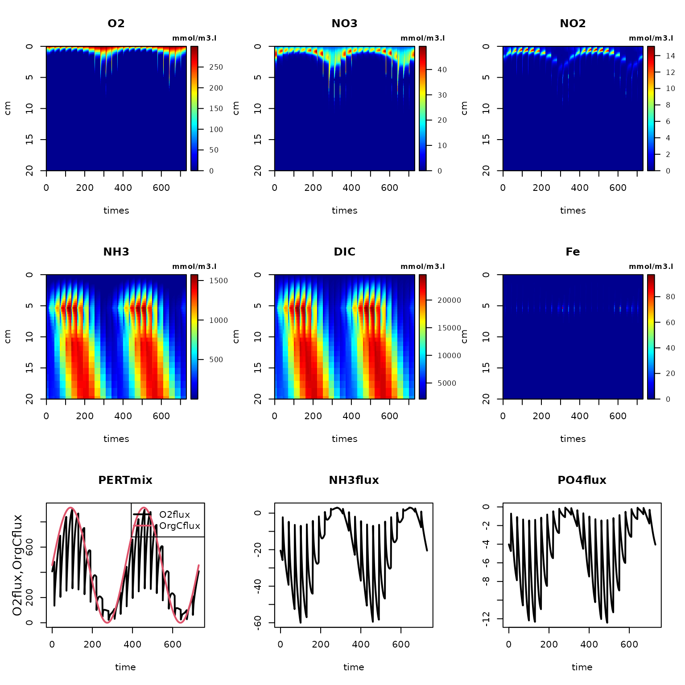
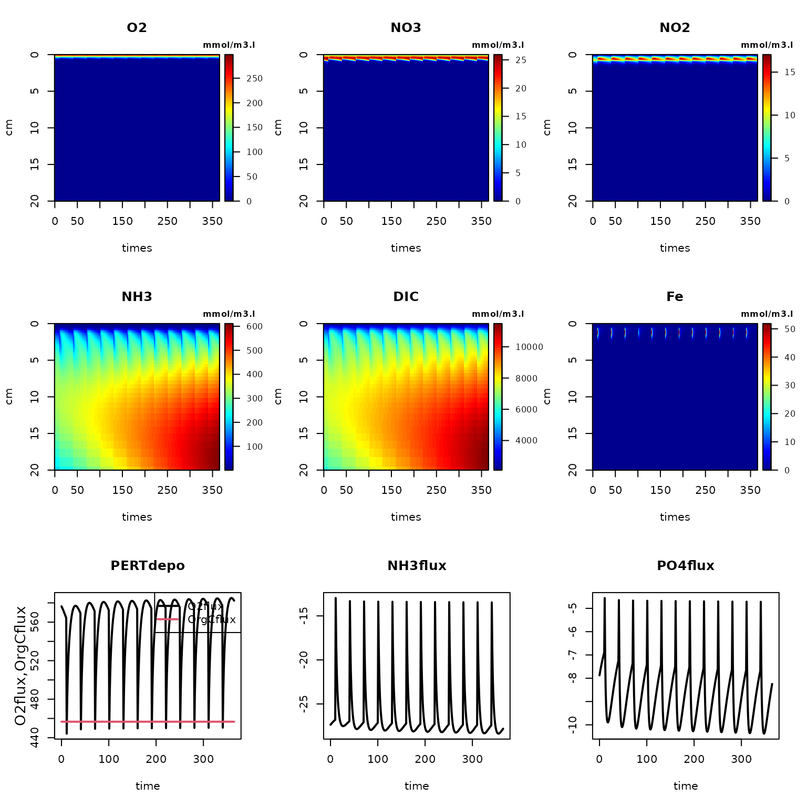
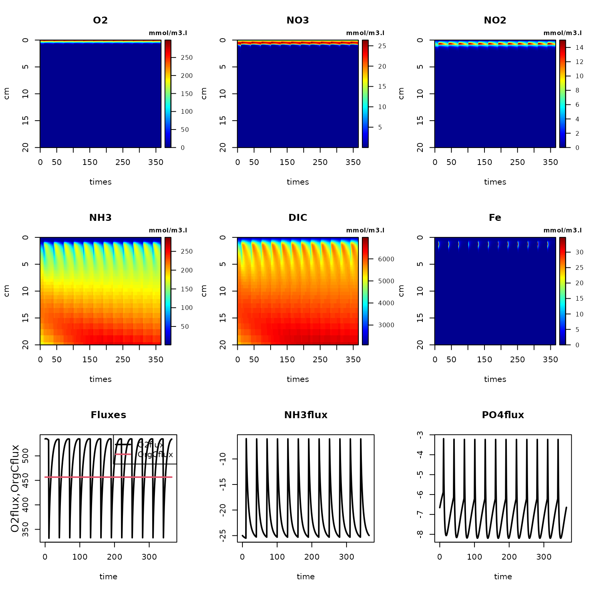
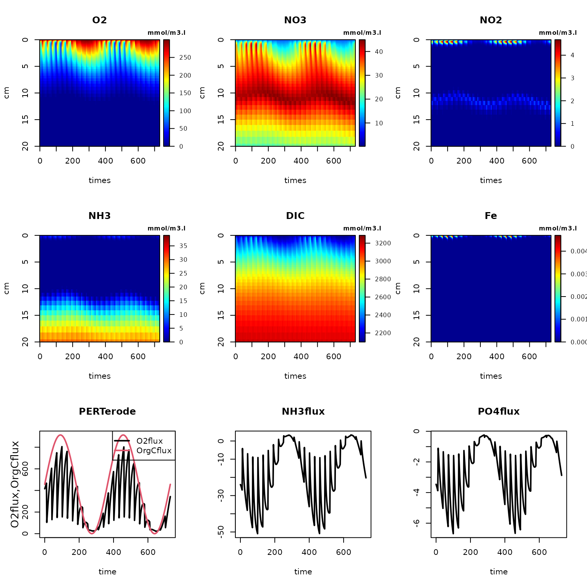
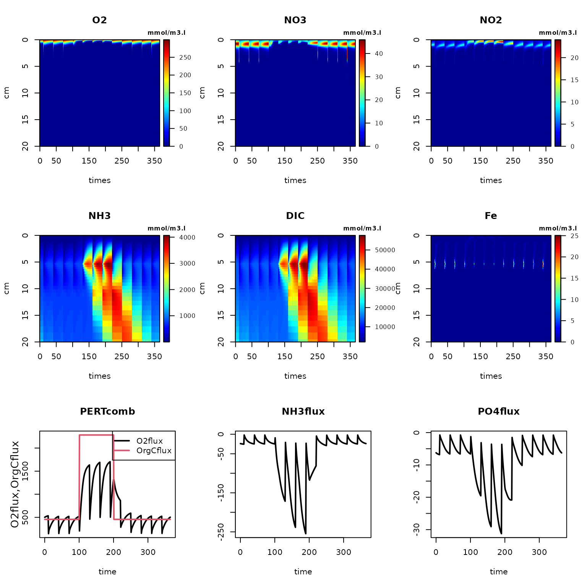
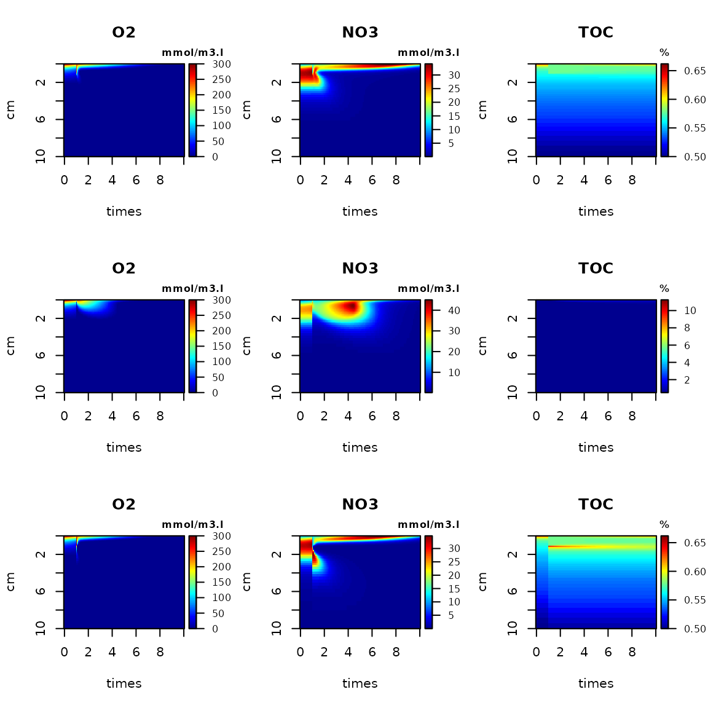
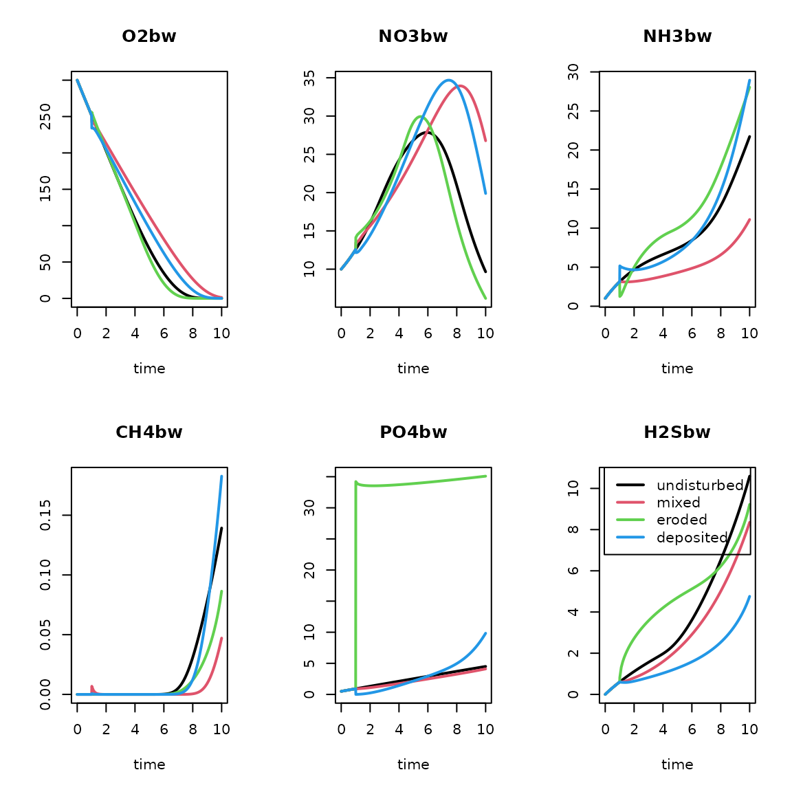
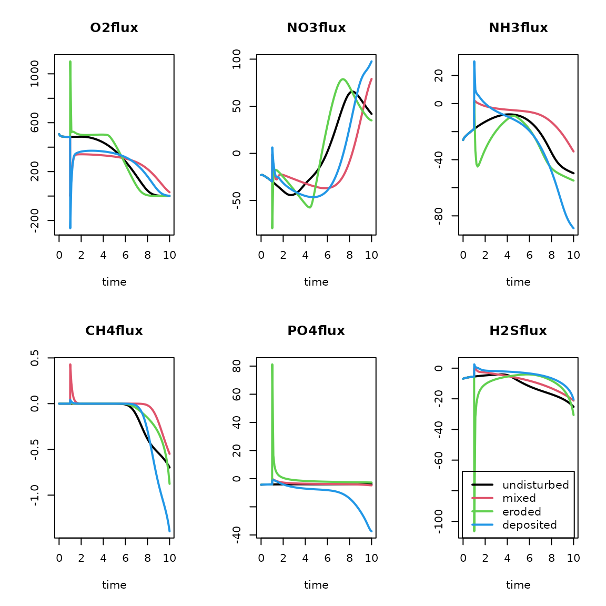
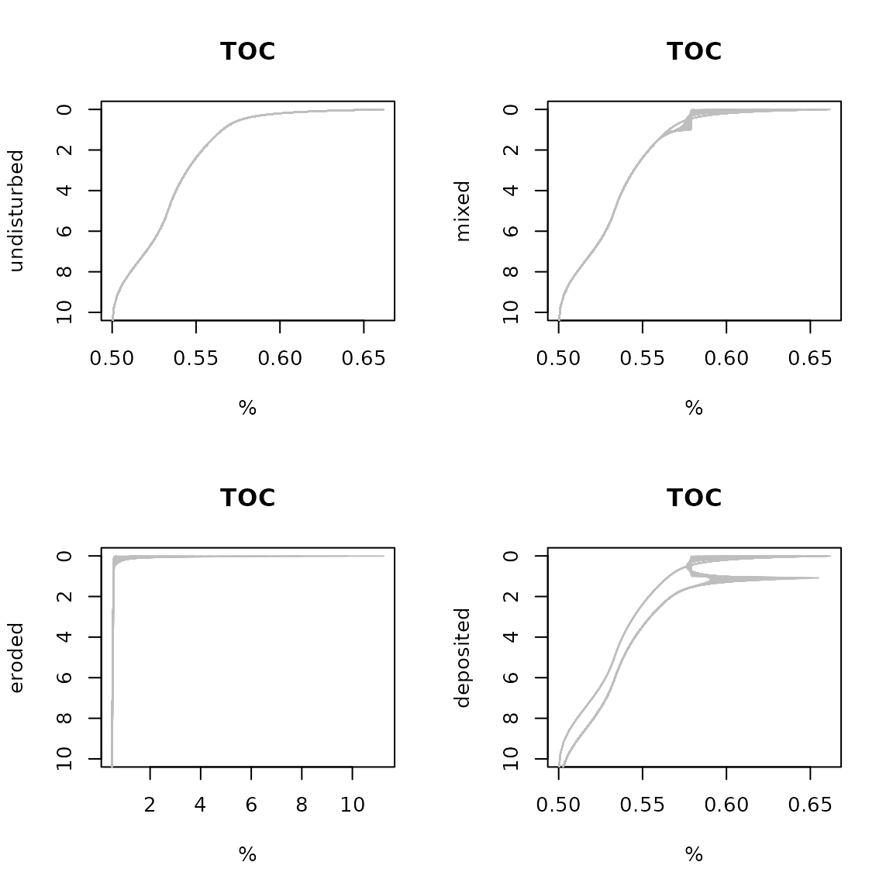

# Delving deeper with event-driven early diagenesis with FESDIA

## FESDIAperturb

``` r
require(FESDIA)
#> Warning: no DISPLAY variable so Tk is not available
```

Tne FESDIA package contains functions to generate diagenetic profiles,
describing the cycles of C, N, O2, Fe, S and P. It is based on the
OMEXDIA model (Soetaert et al., 1996a, b), extended with P, S, Fe
dynamics.

The model describes seventeen state variables, in 100 layers:

- 2 fractions of organic carbon (FDET,SDET): fast and slow decaying,
  solid substance.
- Oxygen (O2), dissolved substance.
- Nitrate (NO3), dissolved substance.
- Nitrite (NO2), dissolved substance.
- Ammonia (NH3), dissolved substance.
- Dissolved inorganic carbon (DIC), dissolved substance
- Iron 2+ (Fe), dissolved substance
- Sulphide (H2S), dissolved substance
- Methane (CH4), dissolved substance
- Phosphate (PO4), dissolved substance
- Alkalinity (ALK), dissolved substance
- Iron hydroxides (FeOH3), solid substance
- Iron-bound P (FeP), P bound to iron oxides, solid substance
- Ca-bound P (CaP), apatite, solid substance
- Adsorbed P (Pads), solid substance

Time is expressed in days, and space is expressed in centimeters.

Concentrations of liquids and solids are expressed in \[nmol/cm3
liquid\] and \[nmol/cm3 solid\] respectively (Note: this is the same as
\[mmol/m3 liquid\] and \[mmol/m3 solid\]).

Compared to the OMEXDIA model, FESDIA includes the following additions:

- simple phosphorus, iron and sulphur dynamics
- long-distance H2S and CH4 oxidation, e.g. by cable bacteria or worms
  associated with chemosynthetic bacteria
- allowing boundary conditions with water overlying sediment or exposure
  to the air.
- external conditions set either with time-variable forcings or as
  constant parameters
- bottom water conditions either imposed or dynamically modeled
- possibility to include sediment perturbation events
- vertical profiles of porosity, irrigation, bioturbation either set
  with parameters or inputted as data.

The model is implemented in fortran (for speed) and linked to R (for
flexibility).

## Main functions

The main functions allow to solve the model to steady state
(*FESDIAsolve*), to run it dynamically (*FESDIAdyna*), or to add
perturbations (*FESDIAperturb*) to dynamic simulations.

### Steady-state solution, function FESDIAsolve

Function *FESDIAsolve* finds the steady-state solution of the FESDIA
model. Its arguments are:

``` r
args(FESDIAsolve)
function (parms = list(), yini = NULL, gridtype = 1, Grid = NULL, 
    porosity = NULL, bioturbation = NULL, irrigation = NULL, 
    surface = NULL, diffusionfactor = NULL, dynamicbottomwater = FALSE, 
    ratefactor = NULL, calcpH = FALSE, verbose = FALSE, method = NULL, 
    times = c(0, 1e+06), ...) 
NULL
```

here *parms* is a list with a subset of the FESDIA parameters (see main
vignette for what they mean and their default values). If unspecified,
then the default parameters are used.

### Dynamic run, function FESDIAdyna

Function *FESDIAdyna* runs the model dynamically without perturbations.
Its arguments are:

``` r
args(FESDIAdyna)
function (parms = list(), times = 0:365, spinup = NULL, yini = NULL, 
    gridtype = 1, Grid = NULL, porosity = NULL, bioturbation = NULL, 
    irrigation = NULL, surface = NULL, diffusionfactor = NULL, 
    dynamicbottomwater = FALSE, CfluxForc = NULL, FeOH3fluxForc = NULL, 
    CaPfluxForc = NULL, O2bwForc = NULL, NO3bwForc = NULL, NO2bwForc = NULL, 
    NH3bwForc = NULL, FebwForc = NULL, H2SbwForc = NULL, SO4bwForc = NULL, 
    CH4bwForc = NULL, PO4bwForc = NULL, DICbwForc = NULL, ALKbwForc = NULL, 
    wForc = NULL, biotForc = NULL, irrForc = NULL, rFastForc = NULL, 
    rSlowForc = NULL, pFastForc = NULL, MPBprodForc = NULL, gasfluxForc = NULL, 
    MnbwForc = NULL, MnO2fluxForc = NULL, HwaterForc = NULL, 
    ratefactor = NULL, calcpH = FALSE, verbose = FALSE, ...) 
NULL
```

### Perturbation run, function FESDIAperturb

Function *FESDIAperturb* runs the FESDIA model for a specific time
interval while adding perturbations at requested times.

Its arguments are:

``` r
args(FESDIAperturb)
function (parms = list(), times = 0:365, spinup = NULL, yini = NULL, 
    gridtype = 1, Grid = NULL, porosity = NULL, bioturbation = NULL, 
    irrigation = NULL, surface = NULL, diffusionfactor = NULL, 
    dynamicbottomwater = FALSE, perturbType = "deposit", perturbTimes = NULL, 
    perttype_mat = NULL, perturbDepth = 5, concfac = NULL, CfluxForc = NULL, 
    FeOH3fluxForc = NULL, CaPfluxForc = NULL, O2bwForc = NULL, 
    NO3bwForc = NULL, NO2bwForc = NULL, NH3bwForc = NULL, FebwForc = NULL, 
    H2SbwForc = NULL, SO4bwForc = NULL, CH4bwForc = NULL, PO4bwForc = NULL, 
    DICbwForc = NULL, ALKbwForc = NULL, wForc = NULL, biotForc = NULL, 
    irrForc = NULL, rFastForc = NULL, rSlowForc = NULL, pFastForc = NULL, 
    MPBprodForc = NULL, gasfluxForc = NULL, HwaterForc = NULL, 
    ratefactor = NULL, MnbwForc = NULL, MnO2fluxForc = NULL, 
    verbose = FALSE, extmix = FALSE, ...) 
NULL
```

The functions to run the model dynamically also allow for several
external conditions to be either constants or to vary in time. Thus,
they can be set by a parameter or as a forcing function.

These conditions are:

- the flux of carbon, CaP and FeP (*Cflux, CaPflux, FeOH3flux*),
  forcings *CfluxForc, CaPfluxForc, FeOH3fluxForc*),  
- the bottom water concentrations (*O2bw, NO2bw, NO3bw, NH3bw, H2Sbw,
  PO4bw, DICbw, ALKbw*), forcings *O2bwForc, NO3bwForc, NO2bwForc,
  NH3bwForc, ODUbwForc, PO4bwForc, DICbwForc, ALKbwForc*)
- the sedimentation, bioturbation and bio-irrigation rates (*w, biot,
  irr*), (*wForc, biotForc, irrForc*)
- the decay rates of organic matter (*rFast, rSlow*) and the fraction
  fast organic matter present in the flux (*pFast*), forcings
  (*rFastForc, rSlowForc, pFastForc*)
- the microphytobenthos production rate (*MPBprod*), (*MPBprodForc*)
- the air-sea exchange rate when exposed to the air (*gasflux*),
  (*gasfluxForc*)
- the height of the overlying water (*Hwater*), (*HwaterForc*), used
  only if *dynamicbottomwater* is *TRUE*.
- *ratefac* is a (time series or a constant) multiplication factor, that
  is multiplied with all biogeochemical rates. It can be used to impose
  temperature dependency.

These forcing functions are either prescribed as a list that either
contains a data series (*list (data = …)*) or as a list that specifies a
periodic signal, defined by the amplitude (*amp*), *period*, *phase*, a
coefficient that defines the strength of the periodic signal (*power*)
and the minimum value (*min*) : the default settings are: *list(amp = 0,
period = 365, phase = 0, pow = 1, min = 0)*. The mean value in the sine
function is given by the corresponding parameter.

For instance, for the C flux, the seasonal signal would be defined as:
$max(min,Cflux*\left( 1 + \left( amp*sin\left( (times - phase)/period*2*pi \right) \right)^{p}ow \right)$.

Three types of perturbations are possible (argument *perturbType*):

- *mixing* straightens the profiles over a certain depth
- *erosion* removes part of the surficial sediment
- *deposition* adds sediment on top.

These perturbations are implemented as events, and need input of the
perturbation times (*perturbTimes*), and the depth (*perturbDepth*). For
deposition events, the factor of increase/decrease of the solid fraction
concentration can also be inputted (*concfac*).

### Accessory functions

The default values of the parameters, and their units can be
interrogated:

``` r
P  <- FESDIAparms()
head(P)
#>                  parms       units                description
#> Cflux     4.566210e+02 nmolC/cm2/d total organic C deposition
#> pFast     9.000000e-01           -   part FDET in carbon flux
#> FeOH3flux 1.000000e+00  nmol/cm2/d   deposition rate of FeOH3
#> CaPflux   0.000000e+00  nmol/cm2/d     deposition rate of CaP
#> rFast     6.849315e-02          /d            decay rate FDET
#> rSlow     1.369863e-04          /d            decay rate SDET
```

See the appendix of the main vignette for a complete list of the
parameters.

Note: some parameters only apply if the bottom water concentration is
modeled dynamically; they comprise the *dilution* of the bottom water
(nudging to bottom water concentration), the height of the bottom water
(*Hwater*), and the sinking rate of the solid constituents (C, FeP,
FeOH3) (parameters *Cfall*, *FePfall* and *FeOH3fall*).

### Budgets

Once the model is solved, it is possible to calculate budgets of the C,
N, P, S, Fe and O2 cycle (*FESDIAbudgetC*, *FESDIAbudgetN*,
*FESDIAbudgetP*, *FESDIAbudgetS*, *FESDIAbudgetFe*, *FESDIAbudgetO2*).

``` r
std <- FESDIAsolve()
print(FESDIAbudgetC(std))
#> Warning in rbind(deparse.level, ...): number of columns of result, 7, is not a
#> multiple of vector length 4 of arg 2
#> $Fluxes
#>                  FDET         SDET           DIC           CH4 CinCaP CaCO3
#> surface  4.109589e+02 4.566210e+01 -4.550175e+02 -4.391394e-08      0     0
#> bottom  1.001633e-191 1.168446e-71  4.502289e-03  1.702274e-44      0     0
#> perturb  0.000000e+00 0.000000e+00  0.000000e+00  0.000000e+00      0     0
#> netin    4.109589e+02 4.566210e+01 -4.550220e+02 -4.391394e-08      0     0
#>         ARAG       Total
#> surface    0 1.603499474
#> bottom     0 0.004502289
#> perturb    0 0.000000000
#> netin      0 1.598997186
#> 
#> $Rates
#>             OxicMineralisation Denitrification ManganeseReduction IronReduction
#> nmolC/cm2/d           427.0496         9.43749         0.09673114     0.1253984
#>             SulphateReduction Methanogenesis TotalMineralisation CH4oxidation
#> nmolC/cm2/d          19.27247      0.6393563             456.621   0.01795032
#>             MnCO3precitation CH4oxid.dist CH4oxidAOM MPBDICuptake
#> nmolC/cm2/d        0.7167273            0  0.3017278            0
#>             MPBFDETproduction MPBResp CaPprecipitation CaPdissolution
#> nmolC/cm2/d                 0       0                0              0
#>             CaCO3dissolution ARAGdissolution CaCO3production
#> nmolC/cm2/d                0               0               0
#> 
#> $Losses
#> [1] 0.004502289
#> 
#> $dC
#>           Ext           DET           DIC           CaP           CH4 
#>  1.603500e+00 -5.684342e-14 -8.822699e-01  0.000000e+00 -4.392358e-08 
#>           MPB         MnCO3         CaCO3          ARAG        Burial 
#>  0.000000e+00 -7.167273e-01  0.000000e+00  0.000000e+00 -4.502289e-03 
#>           sum 
#> -1.012818e-14 
#> 
#> $Delta
#> [1] 1.598997
#> 
#> $Fluxmat
#>             Ext     DET         DIC CaP       CH4 MPB     MnCO3 CaCO3 ARAG
#> Ext      0.0000 456.621   0.0000000   0 0.0000000   0 0.0000000     0    0
#> DET      0.0000   0.000 456.3013264   0 0.3196781   0 0.0000000     0    0
#> DIC    455.0175   0.000   0.0000000   0 0.0000000   0 0.7167273     0    0
#> CaP      0.0000   0.000   0.0000000   0 0.0000000   0 0.0000000     0    0
#> CH4      0.0000   0.000   0.3196781   0 0.0000000   0 0.0000000     0    0
#> MPB      0.0000   0.000   0.0000000   0 0.0000000   0 0.0000000     0    0
#> MnCO3    0.0000   0.000   0.0000000   0 0.0000000   0 0.0000000     0    0
#> CaCO3    0.0000   0.000   0.0000000   0 0.0000000   0 0.0000000     0    0
#> ARAG     0.0000   0.000   0.0000000   0 0.0000000   0 0.0000000     0    0
#> Burial   0.0000   0.000   0.0000000   0 0.0000000   0 0.0000000     0    0
#>              Burial
#> Ext    0.000000e+00
#> DET    1.168446e-71
#> DIC    4.502289e-03
#> CaP    0.000000e+00
#> CH4    0.000000e+00
#> MPB    0.000000e+00
#> MnCO3  0.000000e+00
#> CaCO3  0.000000e+00
#> ARAG   0.000000e+00
#> Burial 0.000000e+00
```

## Perturbation runs

First the default run:

``` r
times <- 0:730
DIA <- FESDIAdyna(Cflux = list(amp = 1), spinup = 0:730, 
        times = times, verbose = FALSE)
```

### Mixing events

We add a mixing event every 30 days, and run this for 2 years, with two
years spinup (spinup not shown).

``` r
times <- 0:730
PERTmix <- FESDIAperturb(Cflux = list(amp = 1), spinup = 0:730, 
        perturbTimes = seq(from = 10, to = 730, by = 30), 
        times = times, verbose = FALSE)
#> 
#> Finish spinup!
#> 
#> tindex after spinup:  0

image2D(PERTmix,  ylim = c(20, 0), which = 3:8, mfrow = c(3,3))
matplot.0D(PERTmix, which = c("OrgCflux", "O2flux"), mfrow = NULL, lty = 1, lwd = 2)
plot(PERTmix, which = c("NH3flux", "PO4flux"), mfrow = NULL, lwd = 2)
```



The instantaneous fluxes

``` r
PertFlux <- attributes(PERTmix)$perturbFlux
knitr:::kable(rbind(PertFlux))
```

|           | time |       FDET |     SDET |       O2 |      NO3 |        NO2 |       NH3 |       DIC |        Fe | FeOH3 | H2S |       SO4 |        CH4 |      PO4 |       FeP |      CaP |      Pads |       ALK |   FeOH3B |         Mn |     MnO2 |    MnO2B |
|:----------|-----:|-----------:|---------:|---------:|---------:|-----------:|----------:|----------:|----------:|------:|----:|----------:|-----------:|---------:|----------:|---------:|----------:|----------:|---------:|-----------:|---------:|---------:|
| Fluxes    |   10 | 32909.8800 | 42102.67 | 819.1553 | 25.51262 | -0.2163121 | -3156.189 | -475.6374 | 0.0169538 |     0 |   0 | -47620.93 | -0.0030312 | 87.90857 | -20199.69 | 23801.53 | -1.290892 | -53041.13 | 69.34964 | -0.0258021 | 60.29834 | 74.72921 |
| Fluxes.1  |   40 | 47808.7413 | 45795.66 | 824.2983 | 25.27546 | -0.4875744 | -2908.309 | -442.5081 | 0.0124938 |     0 |   0 | -45374.46 | -0.0097421 | 72.88548 | -20214.70 | 22458.33 | -1.259895 | -50478.51 | 56.09171 | -0.0331619 | 48.95367 | 59.63648 |
| Fluxes.2  |   70 | 58513.4978 | 51309.83 | 827.8152 | 25.53729 | -0.8659702 | -2740.069 | -420.3916 | 0.0063116 |     0 |   0 | -44135.37 | -0.0167726 | 69.64657 | -20527.63 | 21646.81 | -1.229139 | -49065.61 | 52.11650 | -0.0384314 | 44.58370 | 55.42643 |
| Fluxes.3  |  100 | 62081.9707 | 56369.52 | 828.8831 | 25.94542 | -1.0584519 | -2709.924 | -417.2166 | 0.0026925 |     0 |   0 | -44458.08 | -0.0230779 | 69.13302 | -21168.44 | 21694.85 | -1.234313 | -49434.29 | 49.97645 | -0.0428124 | 42.42204 | 53.31015 |
| Fluxes.4  |  130 | 57629.6708 | 60220.63 | 828.5452 | 25.86548 | -1.0923871 | -2831.721 | -434.7586 | 0.0005040 |     0 |   0 | -46377.03 | -0.0223380 | 69.19285 | -22042.81 | 22645.97 | -1.266213 | -51621.08 | 49.08064 | -0.0425161 | 42.23906 | 52.44411 |
| Fluxes.5  |  160 | 46317.8507 | 61705.52 | 826.8641 | 25.36190 | -0.9649938 | -3078.804 | -469.0951 | 0.0004651 |     0 |   0 | -49466.75 | -0.0169670 | 69.60787 | -22973.58 | 24288.73 | -1.328563 | -55141.73 | 49.34280 | -0.0397696 | 43.77099 | 52.72446 |
| Fluxes.6  |  190 | 31097.1541 | 60328.84 | 822.8024 | 25.15412 | -0.4124406 | -3389.483 | -511.5570 | 0.0018035 |     0 |   0 | -52966.66 | -0.0099293 | 70.08066 | -23759.53 | 26214.94 | -1.422398 | -59132.55 | 50.72342 | -0.0370401 | 46.58278 | 54.09339 |
| Fluxes.7  |  220 | 15937.6460 | 56605.07 | 818.7386 | 25.01880 | -0.4005924 | -3683.910 | -551.4326 | 0.0037174 |     0 |   0 | -56012.16 | -0.0061306 | 70.56765 | -24230.97 | 27944.76 | -1.519136 | -62603.45 | 53.19844 | -0.0328885 | 50.21973 | 56.49989 |
| Fluxes.8  |  250 |  4793.1699 | 51346.04 | 813.8380 | 25.64993 | -0.1877974 | -3889.369 | -578.7825 | 0.0052037 |     0 |   0 | -57858.05 | -0.0029995 | 70.97572 | -24293.80 | 29051.32 | -1.598400 | -64708.97 | 56.68265 | -0.0261300 | 54.31662 | 59.89414 |
| Fluxes.9  |  280 |   570.4697 | 46017.16 | 810.2024 | 26.39845 |  0.0000992 | -3954.173 | -586.8581 | 0.0074643 |     0 |   0 | -58062.72 | -0.0009463 | 73.19588 | -23955.30 | 29266.07 | -1.628844 | -64943.44 | 61.19786 | -0.0176734 | 58.51440 | 64.68281 |
| Fluxes.10 |  310 |  4370.9683 | 41979.50 | 809.8538 | 26.49585 | -0.0379862 | -3862.947 | -573.8366 | 0.0109330 |     0 |   0 | -56604.09 | -0.0068032 | 80.50766 | -23326.35 | 28548.23 | -1.600116 | -63279.45 | 67.93569 | -0.0202492 | 63.33090 | 73.38252 |
| Fluxes.11 |  340 | 15203.3231 | 40288.00 | 812.8802 | 26.21065 | -0.1005565 | -3641.825 | -543.3601 | 0.0149571 |     0 |   0 | -53894.36 | -0.0020874 | 82.76980 | -22595.72 | 27098.81 | -1.532230 | -60187.14 | 68.45562 | -0.0176622 | 62.11425 | 74.97024 |
| Fluxes.12 |  370 | 30242.2896 | 41382.19 | 818.4198 | 25.51409 | -0.2446085 | -3350.932 | -503.7339 | 0.0143872 |     0 |   0 | -50686.62 | -0.0032640 | 76.15401 | -21981.16 | 25317.77 | -1.453078 | -56525.83 | 61.45084 | -0.0246953 | 55.13796 | 65.90766 |
| Fluxes.13 |  400 | 45565.3695 | 44979.97 | 823.7770 | 25.22285 | -0.5089674 | -3070.489 | -465.9074 | 0.0110408 |     0 |   0 | -47883.62 | -0.0084353 | 71.05322 | -21668.34 | 23703.17 | -1.388567 | -53327.51 | 56.02210 | -0.0314609 | 49.23492 | 59.43800 |
| Fluxes.14 |  430 | 57175.9576 | 50165.04 | 827.4246 | 25.46489 | -0.7964449 | -2879.188 | -440.5761 | 0.0067014 |     0 |   0 | -46288.99 | -0.0152161 | 69.39440 | -21758.05 | 22715.26 | -1.352056 | -51508.67 | 52.46274 | -0.0374729 | 45.05302 | 55.76108 |
| Fluxes.15 |  460 | 62045.7850 | 55583.17 | 828.8312 | 25.91131 | -1.0464010 | -2832.075 | -435.1091 | 0.0030734 |     0 |   0 | -46374.66 | -0.0225713 | 69.11633 | -22238.60 | 22643.70 | -1.349733 | -51606.37 | 50.19732 | -0.0425384 | 42.61187 | 53.52682 |
| Fluxes.16 |  490 | 58904.7137 | 59737.69 | 828.6855 | 25.92068 | -1.0929573 | -2944.378 | -451.3203 | 0.0011218 |     0 |   0 | -48141.92 | -0.0229429 | 69.15298 | -22989.94 | 23521.12 | -1.382941 | -53620.48 | 49.12156 | -0.0428592 | 42.12169 | 52.48173 |
| Fluxes.17 |  520 | 48571.9999 | 61282.39 | 827.2863 | 25.46113 | -1.0160039 | -3186.628 | -484.9042 | 0.0006700 |     0 |   0 | -51122.26 | -0.0181185 | 69.52926 | -23818.14 | 25114.50 | -1.451981 | -57017.00 | 49.19933 | -0.0403322 | 43.39750 | 52.58023 |
| Fluxes.18 |  550 | 33742.5542 | 59774.33 | 823.6063 | 25.14604 | -0.4853242 | -3493.325 | -526.6839 | 0.0016733 |     0 |   0 | -54510.63 | -0.0110256 | 70.00317 | -24507.43 | 26991.96 | -1.554976 | -60881.59 | 50.39543 | -0.0375596 | 46.03007 | 53.77171 |
| Fluxes.19 |  580 | 18284.3268 | 55935.80 | 819.5870 | 25.01198 | -0.4913226 | -3779.549 | -565.2694 | 0.0035343 |     0 |   0 | -57392.76 | -0.0068363 | 70.52021 | -24878.44 | 28645.13 | -1.658734 | -64168.07 | 52.68888 | -0.0338107 | 49.55163 | 56.00727 |
| Fluxes.20 |  610 |  6229.1175 | 50674.43 | 814.4896 | 25.61954 | -0.2151621 | -3969.090 | -590.2901 | 0.0051123 |     0 |   0 | -59000.78 | -0.0032360 | 70.83567 | -24838.04 | 29631.93 | -1.737496 | -66004.88 | 56.00776 | -0.0275197 | 53.59966 | 59.22906 |
| Fluxes.21 |  640 |   721.1021 | 45288.98 | 810.7871 | 26.22757 | -0.0278141 | -4010.943 | -595.1407 | 0.0070970 |     0 |   0 | -58914.73 | -0.0014095 | 72.51387 | -24403.33 | 29693.45 | -1.757517 | -65910.04 | 60.29488 | -0.0191283 | 57.75699 | 63.66004 |
| Fluxes.22 |  670 |  3196.9971 | 41194.62 | 809.7698 | 26.51872 | -0.0695102 | -3895.093 | -578.6694 | 0.0102903 |     0 |   0 | -57169.61 | -0.0046847 | 78.67256 | -23696.52 | 28819.90 | -1.714318 | -63922.93 | 66.55277 | -0.0186844 | 62.41210 | 71.52661 |
| Fluxes.23 |  700 | 13010.9871 | 39461.33 | 812.1611 | 26.31844 | -0.0897561 | -3654.181 | -545.4181 | 0.0143336 |     0 |   0 | -54243.04 | -0.0021501 | 82.67600 | -22912.60 | 27250.25 | -1.631391 | -60587.22 | 69.04066 | -0.0175031 | 62.71144 | 75.56175 |

… compared to mean fluxes

``` r
rbind(perturbflux = (colSums(PertFlux)/730)[2:7],   
      ordinary = summary(PERTmix)[4,c("O2flux","NO3flux", "NH3flux", "H2Sflux", "DICflux", "PO4flux")])
#>                O2flux    NO3flux   NH3flux      H2Sflux       DICflux
#> perturbflux 1034.1446 1670.58684  26.97082    0.8448811   -0.01631402
#> ordinary     394.4741  -19.66699 -19.04449 -186.0489294 -525.57296352
#>                 PO4flux
#> perturbflux -110.839171
#> ordinary      -4.418762
```

### deposition events - no loss in organics

We add a deposition event every month, and run this for 1 year, with one
year spinup (spinup not shown). Here we keep the deposition flux
constant.

In the first run, the deposited sediment has the same concentration of
solids as that which is present (concfac = 1).

``` r
times <- 0:365
  PERTdepo <- FESDIAperturb(spinup = 0:365, times = times, 
         perturbType = "deposit", perturbDepth = 1,
        perturbTimes = seq(from = 10, to = max(times), by = 30), verbose = FALSE)
#> 
#> Finish spinup!
#> 
#> tindex after spinup:  0
image2D(PERTdepo, ylim = c(20, 0), which = 3:8, mfrow = c(3,3))
matplot.0D(PERTdepo, which = c("OrgCflux", "O2flux"), mfrow = NULL, lty = 1, lwd = 2)
plot(PERTdepo, which = c("NH3flux", "PO4flux"), mfrow = NULL, lwd = 2)
```



The instantaneous fluxes, compared to the other fluxes

``` r
PertFlux <- attributes(PERTdepo)$perturbFlux
rbind(perturbflux = (colSums(PertFlux)/365)[2:7],   
      ordinary = summary(PERTdepo)[4,c("O2flux","NO3flux", "NH3flux", "H2Sflux", "DICflux", "PO4flux")])
#>               O2flux    NO3flux    NH3flux      H2Sflux       DICflux
#> perturbflux 510.4940 4105.94851   5.849741    0.1506222   -0.01409657
#> ordinary    561.9297  -27.35956 -26.363849 -283.1181959 -951.37594152
#>                PO4flux
#> perturbflux -0.4948736
#> ordinary    -8.8013916
```

### Deposition - loss in organics

The second run has half the concentration of solids as originally
present (concfac = 0.5).

``` r
times <- 0:365
PERTdepo2 <- FESDIAperturb(spinup = 0:365, times = times, 
        perturbType = "deposit", perturbDepth = 1, concfac = 0.5, 
        perturbTimes = seq(from = 10, to = max(times), by = 30), verbose = FALSE)
#> 
#> Finish spinup!
#> 
#> tindex after spinup:  0
image2D(PERTdepo2, ylim = c(20, 0), which = 3:8, mfrow = c(3,3))
matplot.0D(PERTdepo2, which = c("OrgCflux", "O2flux"), mfrow = NULL, lty = 1, lwd = 2, main = "Fluxes")
plot(PERTdepo2, which = c("NH3flux", "PO4flux"), mfrow = NULL, lwd = 2)
```



The instantaneous fluxes, compared to the other fluxes

``` r
PertFlux <- attributes(PERTdepo2)$perturbFlux
rbind(perturbflux = (colSums(PertFlux)/365)[2:7],   
      ordinary = summary(PERTdepo2)[4,c("O2flux","NO3flux", "NH3flux", "H2Sflux", "DICflux", "PO4flux")])
#>               O2flux   NO3flux    NH3flux      H2Sflux       DICflux    PO4flux
#> perturbflux 392.0513 202.45342   5.814262    0.1513268   -0.01025095 -0.5828644
#> ordinary    493.6299 -23.90446 -21.365418 -200.0269971 -762.18986513 -7.1001416
```

### erosion

An erosion event every month removes a fraction of the sediment

``` r
times <- 0:365*2
PERTerode <- FESDIAperturb(Cflux = list(amp = 1), spinup = 0:365, times = times, 
        perturbType = "erode", perturbDepth = 1,
        perturbTimes = seq(from = 10, to = max(times), by = 30), verbose = FALSE)
#> 
#> Finish spinup!
#> 
#> tindex after spinup:  0

image2D(PERTerode, ylim = c(20, 0), which = 3:8, mfrow = c(3,3))
matplot.0D(PERTerode, which = c("OrgCflux", "O2flux"), mfrow = NULL, lty = 1, lwd = 2)
plot(PERTerode, which = c("NH3flux", "PO4flux"), mfrow = NULL, lwd = 2)
```



The instantaneous fluxes, compared to the other fluxes

``` r
PertFlux <- attributes(PERTerode)$perturbFlux
rbind(perturbflux = (colSums(PertFlux)/365)[2:7],   
      ordinary = summary(PERTerode)[4,c("O2flux","NO3flux", "NH3flux", "H2Sflux", "DICflux", "PO4flux")])
#>                O2flux  NO3flux   NH3flux    H2Sflux       DICflux   PO4flux
#> perturbflux -347.3248 -92.0812  -7.23974 -0.6726225   -0.06298925  1.271287
#> ordinary     294.6011 -12.6124 -17.70811 -0.6918102 -264.49391771 -2.531527
```

``` r
cbind(FESDIAbudgetO2(DIA)$Fluxes, FESDIAbudgetO2(PERTerode)$Fluxes) 
#> Warning in rbind(deparse.level, ...): number of columns of result, 1, is not a
#> multiple of vector length 2 of arg 2
#>                    O2             O2
#> surface  4.952836e+02   2.943689e+02
#> bottom  8.847165e-172  1.690444e-129
#> perturb  0.000000e+00  -3.619870e+00
#> netin    4.952836e+02   2.907490e+02
```

### Mixing with variable forcings

We now combine a mixing event with a variable carbon deposition, imposed
as a data series.

``` r
times <- 0:365
fluxforcdat <- data.frame(time = c(0, 100, 101, 200, 201, 365),
                          flux = c(20, 20, 100, 100, 20, 20)*1e5/12/365)
BASE <- FESDIAdyna(spinup = 0:365, times = times, 
        Cflux = list(data = fluxforcdat))

PERTcomb <- FESDIAperturb(spinup = 0:365, times = times, 
        Cflux = list(data = fluxforcdat),                         
        perturbTimes = seq(from = 10, to = max(times), by = 30))
#> 
#> Finish spinup!
#> 
#> tindex after spinup:  0

image2D(PERTcomb, ylim = c(20, 0), which = 3:8, mfrow = c(3,3))
matplot.0D(PERTcomb, which = c("OrgCflux", "O2flux"), mfrow = NULL, lty = 1, lwd = 2)
plot(PERTcomb, which = c("NH3flux", "PO4flux"), mfrow = NULL, lwd = 2)
```



### Mixing with explicitly modeled bottom water conditions

The simulation where bottomwater concentrations are also modeled is
initiated with the steady-state conditions, while keeping the bottom
water conditions constant.

``` r
std <- FESDIAsolve(dynamicbottomwater = FALSE, parms = list(Cflux = 20*1e5/12/365))
FESDIAbudgetO2(std, which = "Fluxes")
#> Warning in rbind(deparse.level, ...): number of columns of result, 1, is not a
#> multiple of vector length 2 of arg 2
#>               O2
#> surface 506.9599
#> bottom    0.0000
#> perturb   0.0000
#> netin   506.9599
```

The initial conditions for the dynamic bottom water concentration run
needs to have the bottom water concentrations in the first row.

The model is run for a couple of days, for mixing, erosion and
deposition events.

``` r
P <- FESDIAparms(std, as.vector = TRUE)[c("O2bw", "NO3bw", "NO2bw", "NH3bw", "DICbw", "Febw", "H2Sbw", "SO4bw", "CH4bw", "PO4bw", "ALKbw")]
# order of state variables, FDET,SDET,O2,NO3,NO2,NH3,DIC,Fe,FeOH3,H2S,SO4,CH4,PO4,FeP,CaP,Pads,ALK
BW <- c(0, 0, P[c("O2bw","NO3bw","NO2bw","NH3bw","DICbw","Febw")], 0, P[c("H2Sbw","SO4bw","CH4bw","PO4bw")], 0, 0, 0,P["ALKbw"])  
times = seq(0, 10, length.out = 100)
dyn  <- FESDIAdyna  (dynamicbottomwater = TRUE, yini = rbind(BW, std$y), 
        parms = list(Cflux = 20*1e5/12/365), times = times)
#> Warning in rbind(BW, std$y): number of columns of result is not a multiple of
#> vector length (arg 1)
dyn1 <- FESDIAperturb(dynamicbottomwater = TRUE, yini = rbind(BW, std$y), 
                     perturbType = "mix", perturbTimes = 1, perturbDepth = 1,
        parms = list(Cflux = 20*1e5/12/365), times = times)
#> Warning in rbind(BW, std$y): number of columns of result is not a multiple of
#> vector length (arg 1)
#> 
#> Finish spinup!
#> 
#> tindex after spinup:  0
dyn2 <- FESDIAperturb(dynamicbottomwater = TRUE, yini = rbind(BW, std$y), 
                     perturbType = "erode", perturbTimes = 1, perturbDepth = 1,
        parms = list(Cflux = 20*1e5/12/365), times = times)
#> Warning in rbind(BW, std$y): number of columns of result is not a multiple of
#> vector length (arg 1)
#> 
#> Finish spinup!
#> 
#> tindex after spinup:  0
dyn3 <- FESDIAperturb(dynamicbottomwater = TRUE, yini = rbind(BW, std$y), 
                     perturbType = "deposit", perturbTimes = 1, perturbDepth = 1,
        parms = list(Cflux = 20*1e5/12/365), times = times)
#> Warning in rbind(BW, std$y): number of columns of result is not a multiple of
#> vector length (arg 1)
#> 
#> Finish spinup!
#> 
#> tindex after spinup:  0
```

``` r
image2D(dyn1, which = c("O2", "NO3", "TOC"), ylim = c(10,0), mfrow = c(3,3))
image2D(dyn2, which = c("O2", "NO3", "TOC"), ylim = c(10,0), mfrow = NULL)
#> Warning in rep(dots, length.out = n): 'x' is NULL so the result will be NULL
image2D(dyn3, which = c("O2", "NO3", "TOC"), ylim = c(10,0), mfrow = NULL)
#> Warning in rep(dots, length.out = n): 'x' is NULL so the result will be NULL
```



``` r

plot(dyn, dyn1, dyn2, dyn3, which = c("O2bw","NO3bw","NH3bw","CH4bw","PO4bw","H2Sbw"), 
     type = "l", lwd = 2, lty = 1)
legend("top", col =1:4, lty = 1, lwd = 2, legend = c("undisturbed", "mixed", "eroded", "deposited"))
```



``` r
plot(dyn, dyn1, dyn2, dyn3, which = c("O2flux","NO3flux","NH3flux","CH4flux","PO4flux","H2Sflux"), 
     type = "l", lwd = 2, lty = 1)
legend("bottom", col =1:4, lty = 1, lwd = 2, legend = c("undisturbed", "mixed", "eroded", "deposited"))
```



``` r
par(mfrow = c(2,2))
matplot1D(dyn, which = "TOC", type = "l", 
           col = "grey", ylim = c(10,0), mfrow = NULL, ylab = "undisturbed")
matplot1D(dyn1, which = "TOC", type = "l", 
           col = "grey", ylim = c(10,0), mfrow = NULL, ylab = "mixed")
matplot1D(dyn2, which = "TOC", type = "l", 
           col = "grey", ylim = c(10,0), mfrow = NULL, ylab = "eroded")
matplot1D(dyn3, which = "TOC",  type = "l", 
           col = "grey", ylim = c(10,0), mfrow = NULL, ylab = "deposited")
```



## References

Soetaert K, PMJ Herman and JJ Middelburg, 1996a. A model of early
diagenetic processes from the shelf to abyssal depths. Geochimica
Cosmochimica Acta, 60(6):1019-1040.

Soetaert K, PMJ Herman and JJ Middelburg, 1996b. Dynamic response of
deep-sea sediments to seasonal variation: a model. Limnol. Oceanogr.
41(8): 1651-1668.
